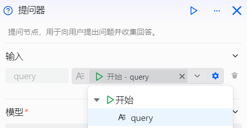
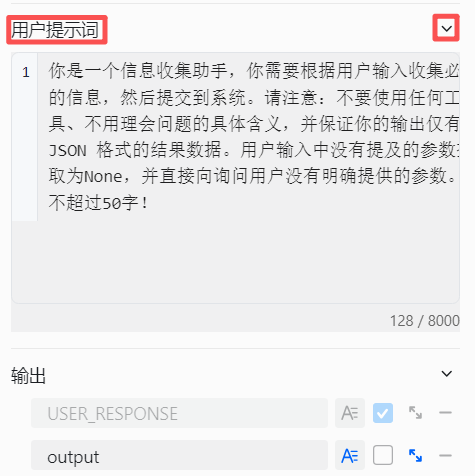
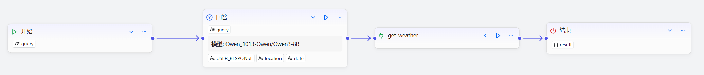

# 配置提问器组件

提问器组件是工作流设计中的智能对话交互组件，专为需要构建智能对话流程的开发者设计，用于在工作流执行需要依赖用户提供信息或明确意图的场景下，解决工作流中组件执行对用户信息的依赖问题。它通过以下方式实现智能信息收集：

- **主动提问**：当工作流触发包含提问器组件的流程时，智能体自动向用户提出预设问题并等待回应
- **灵活交互**：支持开放式问题，用户可直接用自然语言回复，系统提取完整内容或关键字段
- **智能追问**：若用户回复与预期信息不匹配（如缺少必填字段或类型不一致），系统会自动进行追问，直至获取所需关键信息

通过这种方式，提问器组件能让对话交互更加流畅自然，确保工作流在需要用户输入时能智能、高效地收集信息。例如，在天气查询场景中，系统会询问日期和城市信息，并从用户回复中提取位置字段。如果用户提供的信息不完整，系统会继续询问以补充缺失的信息。

# 配置组件

## 操作步骤
1. 进入openJiuwen平台主页。
2. 进入平台左侧导航栏的工作流编排模块。
3. 单击页面下方的添加组件按钮并单击提问器组件。 

4. 单击在画布上出现的提问器组件即可开始配置提问器组件。 

5. 配置输入参数。 

6. 配置模型。

7. 配置系统提示词。描述需要提问的问题或场景。 

8. 配置用户提示词。 

9. 配置输出参数。

提问器组件的配置项说明如下：

| 配置项  | 说明 |
|-----------|----------------------------------------------------------------------------------------------------------------------------------------------------------------------------------------------------------------------------------------------------------------------------------------|
| 模型    | 选择执行此组件的模型，支持调整生成多样性等参数，使组件效果更符合您的具体需求。 |
| 输入    | 设置需要集成到问题中的参数，参数值可以引用前置组件的输出，或设置为固定文本内容。 |
| 系统提示词 | 附加的系统提示词，用于优化提问效果。 |
| 用户提示词 | 附加的用户提示词，进一步指导模型行为。 |
| 输出  | 在直接回答模式下，组件默认输出 `USER_RESPONSE` 变量，表示用户的完整回复内容。  您可以启用字段提取功能，让模型自动从用户回复中提取关键信息并保存为变量，供下游组件使用。  建议使用有意义的变量名并添加详细描述，帮助模型准确理解变量定义并正确提取信息。  变量可以设置为必填项。如果用户回复中缺少必填字段，工作流会持续追问，直到成功获取信息或达到设定的最大询问次数（默认3次）。追问时的具体问题由模型动态生成，您可以添加系统提示词来设定模型的角色和回复逻辑，使追问更加自然。 |

## 示例

下面给出提问器组件的示例。以天气查询工作流为例，提问器组件用于收集查询天气所需的城市和时间信息，为后续的工具调用提供必要参数：

该天气查询工作流的核心组件包括：
1. 提问器组件：智能收集用户所需的天气查询信息，自动提取关键字段。所有信息都设置为必填项，如果用户回复不完整，系统会持续追问直到获取完整信息。
2. 插件组件：根据提问器组件输出的城市和时间信息，调用天气查询工具获取具体的天气数据。