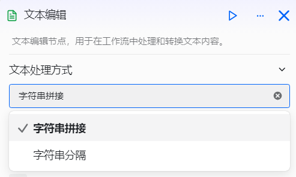
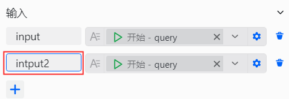
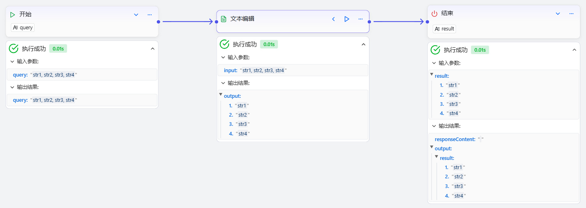

# 配置文本编辑组件

文本编辑组件是工作流中用于文本数据处理的功能组件，专为需要在工作流中处理文本数据的开发者设计，适用于内容二次总结、文本拼接、文本转义等需要对字符串进行处理的场景。它可以解决工作流中文本数据格式不统一、需要组合或拆分的问题。

# 配置组件

## 操作步骤
1. 进入openJiuwen平台主页。
2. 进入平台左侧导航栏的工作流编排模块。
3. 单击页面下方的添加组件按钮并单击文本编辑组件。 

4. 单击在画布上出现的文本编辑组件即可开始配置文本编辑组件。 

5. 选择文本处理方式。支持两种主要的处理方式：**字符串拼接**和**字符串分隔**。 

6. 配置输入参数。 

7. 添加并配置多个输入参数。 

8. 配置输入参数名称。 

9. 配置处理规则。
    1. 字符串拼接——配置字符串拼接规则。 
    
    2. 字符串分隔——配置字符串分隔符。 
    

文本编辑组件的配置如下：

| 配置 | 说明 |
| :------: | :------ |
| 文本处理方式 | 文本编辑组件支持的处理方式，目前主要包括两种：  1. **字符串拼接**：字符串拼接功能可以将输入中指定的内容按照一定的顺序拼接成一个字符串。这在组合前置组件的关键信息时非常有用，可以将这些信息作为后置组件的输入。  2. **字符串分隔**：字符串分隔功能可以将输入中的内容用指定的分隔符拆分为字符串数组，便于后续组件处理。你需要指定指定分隔符来拆分内容，目前支持的分隔符有：换行、逗号、分号、句号和制表符，并且还支持自定义分隔符。|
| 输入参数 | 文本处理所需的输入参数，支持多种类型 |
| 字符串拼接模板 | 选择字符串拼接处理方式时填写，自定义输出的拼接模板 |
| 分隔符 | 选择字符串分隔处理方式时填写，指定用于拆分输入内容的分隔符，并支持自定义分隔符 |

## 示例
1. 字符串拼接
字符串拼接方式使用示例如下： 
 
运行效果如下： 

2. 字符串分隔
字符串分隔方式使用示例如下，通过","分隔： 
 
运行效果如下： 

