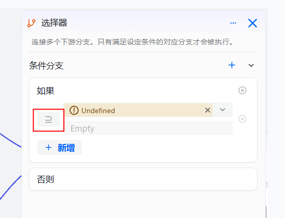
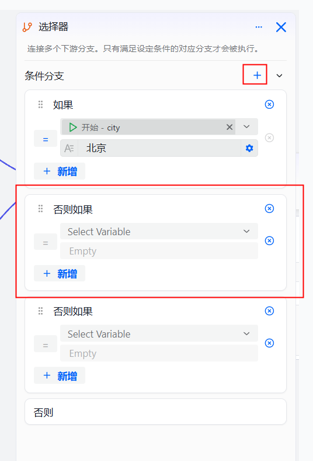

# 选择器组件

选择器组件用于连接多个下游分支，通过设定条件来控制工作流的执行路径。只有满足设定条件的对应分支才会被执行，等同于程序开发中的if-else条件判断节点。该组件可帮助开发者构建复杂的分支逻辑，适用于需要根据不同条件执行不同流程的场景。

## 注意事项

* 条件判断基于工作流执行时的上下文数据，确保引用的变量可用。
* 当多个条件同时满足时，只有第一个满足条件的分支才会被执行。
* 建议为选择器组件配置默认分支，以处理所有条件都不满足的情况。

## 操作步骤

1. 登录openJiuwen平台。

2. 进入平台左侧导航栏的工作流编排模块。

3. 进入工作流编辑页面。

4. 单击页面下方的添加组件按钮并单击选择器。
    

5. 单击选择器组件节点，进入组件配置面板。

6. 单击"选择判断条件"按钮，选择条件类型。
   
   
   
   

7. 在输入框中填写具体的判断条件内容。
   
   

8. 单击`+`按钮可增加判断条件，支持配置多个判断条件和多个条件分支。
   
   

9. 为每个条件分支配置对应的下游节点，完成选择器组件的配置。