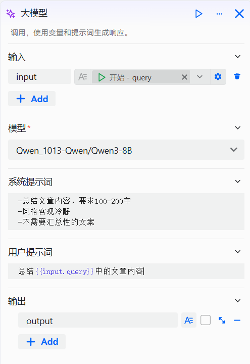

# 配置大模型组件

大模型组件是 openJiuwen 提供的核心功能模块，用于接入大型语言模型（LLM），通过用户输入和定制化提示词，灵活生成符合特定角色、语气或格式要求的高质量自然语言响应，适用于创意写作、信息提炼等多种文本处理场景，并支持对生成参数进行精细调节以优化输出效果。具体配置过程如下：

# 配置组件

## 前提条件

* 已在模型管理中添加了模型

## 操作步骤

1. 进入openJiuwen平台主页。
2. 进入平台左侧导航栏的**工作流编排**模块。
3. 单击页面下方的**添加组件**按钮并单击**大语言模型** 。

4. 单击在画布上出现的大模型组件即可开始配置大模型组件。

需要配置的参数如下所示：

| 参数 | 说明 |
|------|------|
| 输入 | 用于向提示词中注入动态内容的变量集合。每个输入参数需指定参数名和对应的变量值，变量值可以是固定值，也可以引用上游组件的输出结果。系统提示词和用户提示词均可通过变量引用语法使用这些参数，从而实现内容的动态调整。 |
| 模型选择 | 指定执行任务所使用的大语言模型。模型的能力直接影响组件的输出质量，应根据具体应用场景（如文本生成、摘要、推理等）选择最合适的模型。 |
| 系统提示词 | 用于定义模型在对话中的角色定位、行为准则和回复风格。支持使用变量引用语法动态插入输入参数的内容，以增强提示的灵活性和上下文适应性。 |
| 用户提示词 | 表示当前轮次用户向模型发出的具体指令或问题。该字段支持引用输入参数中的变量，使提示内容能够根据运行时数据动态变化，提升交互的针对性和准确性。 |
| 输出 | 设置输出的参数名和描述。清晰的参数名称和描述有助于模型准确返回匹配的内容。当存在多个输出参数时，建议使用有意义的参数名并添加详细的描述信息。 |
