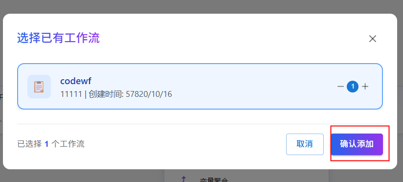
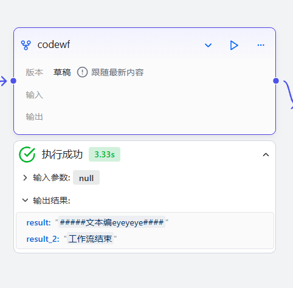

# 工作流组件

工作流组件是 openJiuwen 提供的一项功能，允许用户将已有的工作流作为可复用的子模块嵌入到其他工作流中，通过工作流嵌套实现标准化流程的封装与灵活组装，从而高效编排和自动化执行复杂任务。

# 配置组件

## 前提条件

1. 确保目标工作流已创建
2. 遵循“先测试，后集成”的原则：在添加前，请独立运行并确认子工作流本身功能无误

## 操作步骤

1. 进入openJiuwen平台主页。
2. 进入平台左侧导航栏的**工作流编排**模块。
3. 单击页面下方的**添加组件**按钮并单击**工作流** 。

4. 在弹出的窗口中选择已有的工作流

5. 插入工作流后需要进行以下配置配置与子工作流开始节点同名的输入参数，输出参数为子工作流的输出参数。

| 参数 | 说明 |
| --- | --- |
| 输入 | 子工作流的输入参数，与子工作流开始节点同名。变量值可以是固定值，也可以引用上游组件的输出结果 |
| 输出 | 子工作流的输入参数，与子工作流结束节点的输出相同 |

6. 执行工作流。单击页面下方的**试运行**可以运行包含子工作流的工作流。

在画布中可以看到子工作流的执行结果。

