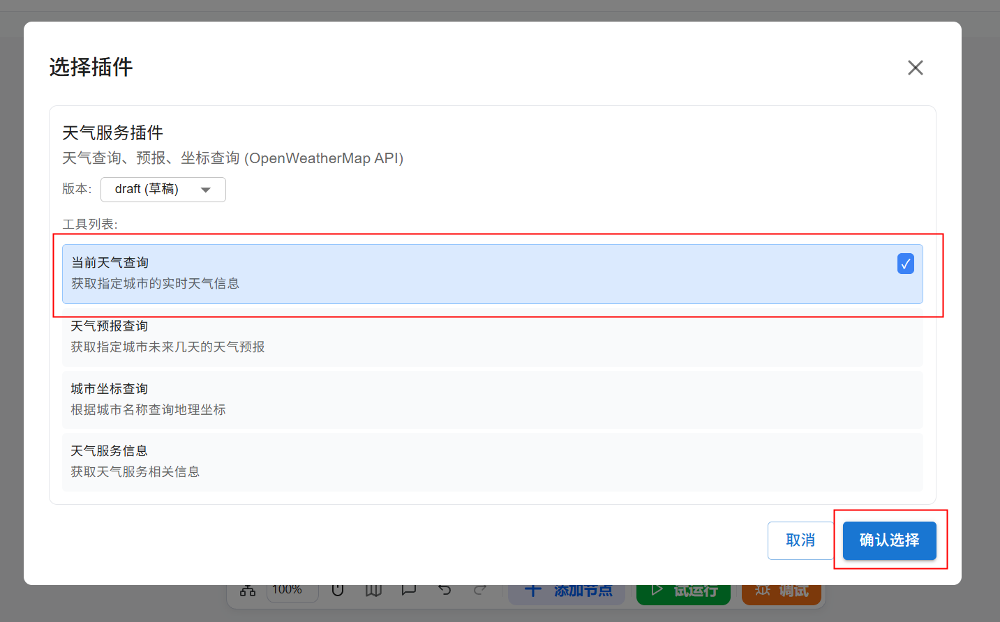

# 插件组件

工作流组件是 openJiuwen 提供的功能模块，允许在工作流中调用外部工具，将封装好的API以节点形式嵌入流程。这些插件可以是平台商店提供的，也可以是用户自定义的，有效拓展智能体的功能边界，使其能够执行更丰富的任务。具体配置过程如下：

# 配置组件

## 前提条件

* 已在插件管理中准备好了可用插件工具。为工作流添加插件需在插件管理界面完成可用插件的配置，配置相关输入、输出参数、版本、工具等内容。添加插件详细指南请参阅[插件管理](../../../插件管理.md)章节。

* 已确认插件可独立运行。为避免因插件异常导致工作流中断，建议用户先在工具配置界面对其进行独立测试，确认工具运行无误后，再添加到工作流中。

## 操作步骤

1. 进入openJiuwen平台主页。
2. 进入平台左侧导航栏的**工作流编排**模块。
3. 单击页面下方的**添加组件**按钮并单击**插件** 。

4. 在弹出的界面中选择插件。用户可以从插件列表中，将任一工具添加为工作流的一个节点。只需选中工具并单击“确认选择”，该工具便会成功集成至工作流画布中。

5. 为必选的输入参数指定数据来源。插件节点的输入和输出结构取决于插件工具定义的输入输出结构，不支持自定义设置。用户需要为必选的输入参数指定数据来源。

当前插件输出结果格式固定为：`error_code` 、`error_message` 和`data`， `data`（`Object`）中包含插件返回的具体结果。

6. 执行工作流。单击页面下方的**试运行**可以运行包含组件的工作流。

在画布中可以看到插件的执行结果。

