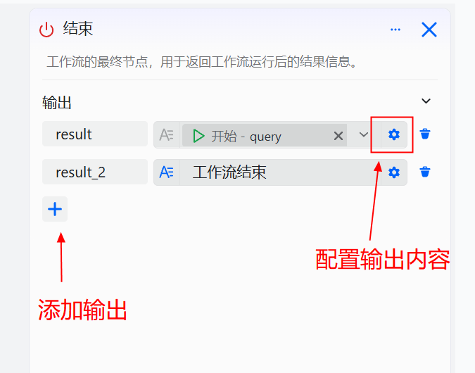

# 结束组件

结束节点用于输出工作流的结果。是工作流的最后一个节点（必要），是工作流的结束。在工作流运行结束后，输出将直接返回指定输出内容。

# 配置组件

## 操作步骤

1. 进入openJiuwen平台主页。
2. 进入平台左侧导航栏的**工作流编排**模块。
3. 单击画布中“结束”组件，打开组件编辑界面。

4. **添加或删除输入参数**​：单击`+`添加参数，单击 删除参数。

结束组件参数说明如下：

| 参数| 说明 |
| --- | --- |
| 左侧输入框 | 输出参数的key |
| 右侧输入框 | 数据类型：支持配置`String`、`Number`、`Object`  等多种类型的参数，变量值可以是固定值，也可以引用上游组件的输出结果。 |

