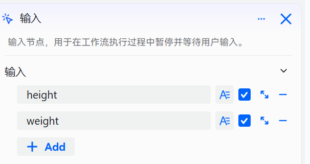
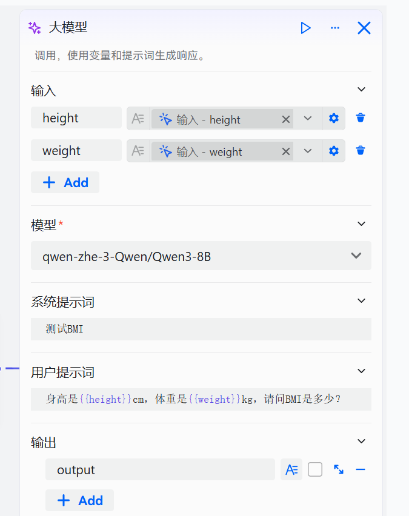

# 输入组件

输入组件用于在工作流运行过程中动态获取用户所需的特定信息，当流程执行到该组件时会自动暂停，等待用户提交必要输入后才继续后续步骤，确保依赖用户数据的复杂任务能够顺利、准确地完成。

# 配置组件

## 操作步骤

1. 进入openJiuwen平台主页。
2. 进入平台左侧导航栏的**工作流编排**模块。
3. 单击页面下方的**添加组件**按钮并单击**输入** 。

4. 在弹出的界面中完成配置。

输入组件支持配置 1 个及以上输入参数，每个参数需按以下规则完成配置，确保工作流正常收集数据并执行：

| 字段 | 说明 |
|------|------|
| 输入参数名称 （Input Variable Name）| 必填项，用于定义输入参数的唯一标识符。该名称将在后续提示词或组件中通过变量引用语法（如 `{{参数名}}`）进行调用。 |
| 参数类型  （type）| 可选配置项，默认为 `String`。支持以下五种数据类型： • **String**：文本类型 • **Integer**：整数类型 • **Number**：浮点数或数值类型 • **Boolean**：布尔值（true/false） • **Object**：JSON对象类型，用于结构化数据输入 |
| 描述信息 （description） | 可选项，用于填写该参数的详细说明，帮助理解其用途和预期内容。有助于提升工作流的可读性和维护性。 |
| 默认值 （default value） | 可选项，设置参数在未提供具体值时的默认取值。若未设置默认值且参数为必选，则运行时需用户手动输入有效值。 |
| 是否必选 | 勾选框控制该参数是否为必填项。 • 若勾选“必选”，则工作流执行至该组件时必须提供有效值，否则流程无法继续。 • 若未勾选，则为可选参数，即使未填写也不会阻断工作流执行。 |

## 示例

通过输入组件获取身高体重数据，并调用模型组件查询其对应的 BMI 值。

该工作流的核心组件说明如下：

| 组件类型 | 配置说明 | 示例 |
| :------: | :------ | :------: |
| 输入组件 | 添加两个必选参数:  ● height，即身高  ● weight，即体重| |
| 大模型组件 | 设置如下参数： ● 输入：添加两个输入参数 height 跟 weight  ● 系统提示词：智能体的人设，按需设计 ● 用户提示词：需要大模型回答的问题，此处引用两个输入参数  ● 输出：维持默认值即可|  |

