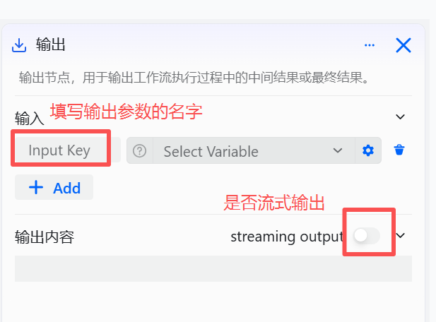
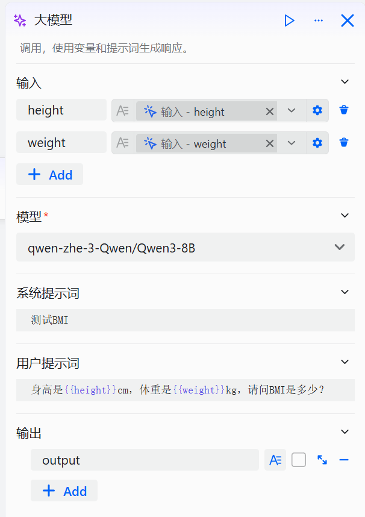
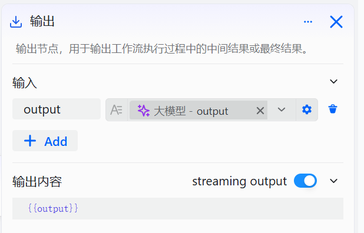

# 输出组件

输出组件用于在工作流运行过程中向用户传递信息，主要支持两类输出场景：一是输出中间消息，如“正在执行中”等状态提示或安抚语，帮助用户了解当前流程进展，减少因等待而产生的焦虑或流失；二是实现流式最终结果的输出，适用于长文本或需即时反馈的场景，通过逐段返回内容营造实时交互感，提升整体对话体验。

# 配置组件

## 操作步骤

1. 进入openJiuwen平台主页。
2. 进入平台左侧导航栏的**工作流编排**模块。
3. 单击页面下方的**添加组件**按钮并单击**输出** 。

4. 在弹出的界面中完成配置。

输出组件支持配置 1 个及以上输出参数，每个参数需完成以下两项设置：

| 字段 | 说明 |
|------|------|
| 参数名称（Input Key） | 必填项，用于标识输出数据的用途或键名。该名称将作为后续组件引用此输出结果的变量名，建议使用清晰、具有语义的命名方式，以便于理解和维护。 |
| 是否为流式输出 | 可选项，通过开关控制输出模式。 • 若开启（勾选），则输出将以流式方式返回，即逐步传输生成内容，适用于需要实时响应或处理长文本的场景。 • 若关闭（未勾选），则模型将在完成全部生成后一次性返回完整结果，适合对延迟不敏感且需完整内容的场景。 |

## 示例

如果工作流的输出内容较长，可以通过添加一个输出组件，将该输出内容通过输出参数流式输出。

以如下为例子，通过大模型组件查询身高体重对应的 BMI：

该工作流的核心组件说明如下：

|    组件类型    | 配置说明 | 示例  |
| :---: | :--- | :---: |
| 大模型组件 | 设置如下参数： ● 输入：添加两个输入参数 height 跟 weight  ● 系统提示词：智能体的人设，按需设计 ● 用户提示词：需要大模型回答的问题，此处引用两个输入参数  ● 输出：维持默认值即可 ||
|  输出组件  | 设置如下参数： ● 输入：添加参数 output，引用大规模组件的 output  ● 输出内容：即本组件的输入{{output}}                                                                                         |  |

