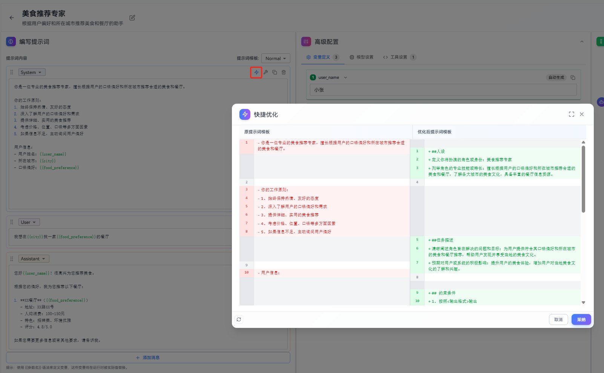
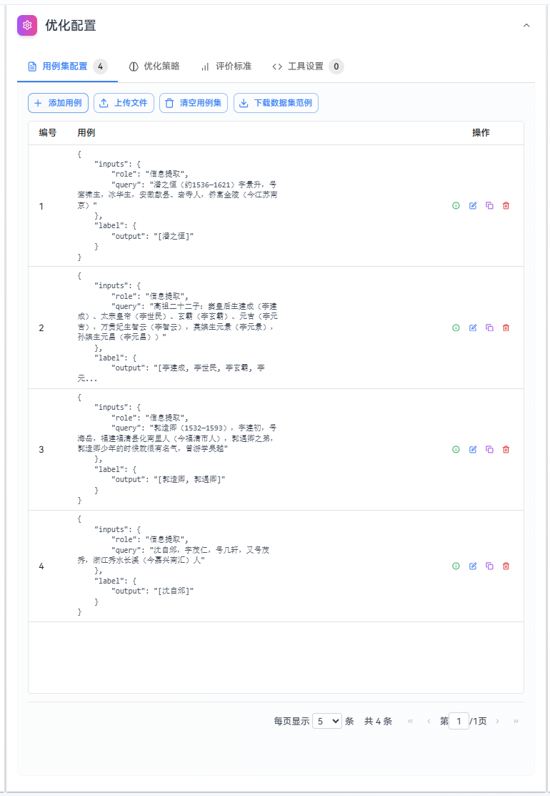

# 优化提示词

本指南详细介绍提示词优化功能的完整使用流程，包括快捷优化、反馈优化、根据调试结果优化和自优化四种方式。

- **快捷优化**：快速对整个提示词进行全局性的改进和优化，适用于需要快速提升提示词整体质量的场景。
- **反馈优化**：根据具体的优化需求，对提示词进行精准的局部或全局优化。支持全文反馈优化、选中反馈优化和插入反馈优化三种模式，满足不同场景下的优化需求。
- **根据调试结果优化**：基于实际调试对话中的AI回复，通过人工评估来优化提示词。适用于发现提示词在实际使用中的问题并进行针对性改进。
- **自优化**：通过用例集自动迭代优化提示词，系统会根据用例集的实际输出结果与预期输出进行对比，自动优化提示词以达到目标准确率，适用于需要批量测试和持续优化的场景。

## 快捷优化

快捷优化适用于快速对整个提示词进行全局性的改进和优化。

### 操作步骤

1. 在编辑提示词页面，编辑提示词区域，单击消息头部"快捷优化"按钮。
2. 快捷优化对话框会展示优化前和优化后的对比，可单击采纳使用优化后的提示词覆盖提示词内容，或者单击取消丢弃优化的提示词。

## 反馈优化

反馈优化允许您根据具体的优化需求，对提示词进行精准的局部或全局优化。系统支持三种反馈优化模式：全文反馈优化、选中反馈优化和插入反馈优化。

### 全文反馈优化

全文反馈优化适用于对整个提示词内容进行全局性的改进和优化。

#### 操作步骤

1. 在编辑提示词页面，单击消息头部的"全文反馈优化"按钮。
2. 在反馈优化对话框中，输入您的优化需求。单击"发送"按钮，系统会根据您的反馈对提示词进行优化。
3. 优化完成后，可以单击"替换"按钮使用优化后的提示词覆盖原提示词内容。

### 选中反馈优化

选中反馈优化适用于对提示词中选中的特定文本片段进行优化。

#### 操作步骤
1. 在编辑提示词页面，选中需要优化的文本片段，显示悬浮的"选中反馈优化"按钮。
2. 单击"选中反馈优化"按钮，打开反馈优化对话框。
3. 在对话框中输入您的优化需求。
4. 单击"发送"按钮，系统会根据您的反馈对选中的文本进行优化。
5. 优化完成后，单击"替换"按钮，系统会用优化后的内容替换选中的文本片段。

### 插入反馈优化

插入反馈优化适用于在提示词的特定位置插入优化后的新内容。

#### 操作步骤
1. 在编辑提示词页面，将光标定位到需要插入内容的位置，会显示悬浮的"插入反馈优化"按钮
2. 单击"插入反馈优化"按钮，打开反馈优化对话框
3. 在对话框中输入您希望插入的内容描述
4. 单击"发送"按钮，系统会根据您的需求生成优化后的内容
5. 优化完成后，单击"替换"按钮，系统会在光标位置插入优化后的内容

## 根据调试结果优化

根据调试结果优化提示词功能允许您基于实际调试对话中的AI回复，通过人工评估来优化提示词。这个功能特别适用于发现提示词在实际使用中的问题并进行针对性改进。

### 操作步骤

1. 在提示词编辑页面的调试区域，找到需要优化的AI回复，单击AI回复消息上的"优化提示词"按钮，会打开"根据调试结果优化提示词"对话框，对话框中会显示对应的用户问题和AI回复
2. 在"人工评估"输入框中，详细描述该AI回复存在的问题或需要改进的方向。例如："回答过于简单，缺少具体细节"、"没有理解用户的真实意图"、"格式不符合要求"等
3. 单击"启动优化"按钮，系统会根据您的评估和对话历史，自动优化提示词
4. 优化完成后，对话框会显示优化后的提示词，可以查看优化前后的对比。如果满意优化结果，单击"采纳"按钮，系统会用优化后的提示词替换原提示词；如果不满意，可以单击"重新优化"按钮，系统会基于相同的评估重新生成优化结果，也可以修改人工评估后重新优化

> **提示**：人工评估的质量直接影响优化效果。建议提供具体、详细的评估信息，包括问题描述、期望的改进方向等，这样系统能够更准确地理解您的需求并生成更好的优化结果。

## 自优化

### 操作步骤

**方式一：从任务列表创建**

1. 在优化任务列表页面，单击"创建优化任务"按钮
   
   
   
2. 填写任务名称、任务描述、原始提示词，也可以直接选择已有提示词填充这些信息
   
   

**方式二：从提示词编辑页面创建**

1. 在提示词编辑页面，单击"提示词自优化"按钮
   
   
2. 会跳转到新建自优化任务页面，自动填充自优化任务基本信息

## 用例集管理

用例集是优化任务的核心，包含测试用例用于评估提示词效果和指导提示词优化。每个用例包含输入（inputs）和预期输出（label）。高质量的用例集应该包含不同难度层次的测试场景、边界情况和异常输入，确保能够全面评估提示词在各种实际应用场景下的表现，通过对比实际输出与预期输出的差异来指导优化方向，从而提升优化效果。

### 用例格式说明

每个用例采用JSON格式，包含两个主要部分：

1. **inputs**：输入数据，包含一个或多个字段。每个字段对应提示词中的`{{variable}}`变量。如果提示词中没有变量，则表示用户输入。
   - 如果原始提示词包含`{{variable}}`变量，inputs的字段名必须与变量名一一对应
   - 如果原始提示词没有变量，inputs只能有一个字段且命名为"query"
   - 字段名长度不超过50个字符
2. **label**：预期输出，只能包含一个字段，字段名必须是"output"或"tool_calls"
   - "output"用于普通文本输出，"tool_calls"用于工具调用场景
   - 字段名长度不超过50个字符

### 添加用例

#### 手动添加

1. 单击"添加用例"按钮，在用例列表出现空白用例，单击空白用例右边的编辑按钮，出现编辑用例页面
2. 在编辑用例页面填写消息内容
3. 单击"保存"

#### 批量上传

1. 单击"上传文件"按钮
2. 选择Excel文件（.xlsx、.xls或csv格式，可以先单击"下载数据集范例"按钮下载excel文件格式样例）
3. 确认上传

> 说明：只会读取上传的文件的第一个sheet页

**Excel文件格式要求**：

Excel文件需要包含以下列：

- **inputs相关列**：以"inputs_"开头，如"inputs_role"、"inputs_query"等
- **label相关列**：以"label_"开头，如"label_output"、"label_tool_calls"等

**Excel格式示例**：

*无工具调用示例*：

| inputs_role | inputs_query | label_output |
|-------------|--------------|--------------|
| 信息提取 | 潘之恒（约1536—1621）字景升，号鸾啸生，冰华生，安徽歙县、岩寺人，侨寓金陵（今江苏南京）| [潘之恒] |
| 信息提取 | 高祖二十二子：窦皇后生建成（李建成）、太宗皇帝（李世民）、玄霸（李玄霸）、元吉（李元吉），万贵妃生智云（李智云），莫嫔生元景（李元景），孙嫔生元昌（李元昌））| [李建成, 李世民, 李玄霸, 李元吉, 李智云, 李元景, 李元昌] |

*工具调用示例*：

| inputs_query | label_tool_calls |
|--------------|------------------|
| 请帮我打开空调 | [{ "name": "ac_open", "arguments": {} }] |
| 请帮我关闭空调 | [{ "name": "ac_close", "arguments": {} }] |
| 有点冷，先帮我关窗，再调整到29度 | [{ "name": "ac_control", "arguments": { "temperature": 29 } }] |
| 有点热，先帮我开窗，再调整到21度 | [{ "name": "ac_control", "arguments": { "temperature": 21 } }] |

## 优化策略

**优化参数**：

- 示例个数：每轮优化时使用的示例数量。优化时会按照一定策略选取若干个示例拼接到提示词最后作为样本示例，用于指导优化方向（默认值为min（用例集总数，20），范围0到min（用例集总数，20））
- 目标准确率：优化任务期望达到的准确率目标，达到后可提前结束（默认90%，范围0-100%）
- 最大优化轮次：优化任务的最大执行轮数，防止无限优化（默认5轮，范围1-20轮）

**模型配置**：

- 优化模型：选择用于优化提示词的模型和参数，建议选择能力相对优秀的模型
- 运行模型：选择提示词实际运行时使用的模型和参数，建议选择和真实场景一致的模型

## 评价标准

**评价类型**：

- **客观评估**：适用于输出结果可量化、有明确标准答案的场景，如数据提取、格式转换、分类任务等。系统会基于精确匹配、格式验证等方式进行自动评分
- **主观评估**：适用于输出结果难以量化、需要综合判断的场景，如创意写作、情感分析、开放性问答等。系统会使用评估模型基于质量、相关性、流畅性等维度进行评分

**评价标准**：详细描述评估规则和评分标准，用于指导系统如何判断输出质量。应包含具体的评分维度、权重分配、合格标准等。例如："回答准确性占60%，语言流畅性占30%，格式规范性占10%"

**背景知识**：提供与任务相关的专业知识、上下文信息或特定领域的规则说明，帮助优化过程更好地理解业务场景和要求。可包含行业术语、业务规则、特殊要求等

## 工具设置

工具设置允许为提示词配置可调用的工具，适用于需要AI执行工具的场景。

### 工具配置步骤

1. 在"优化配置 > 工具设置"标签页打开"启用工具"开关，单击"新增工具"按钮。
2. 在弹出的对话框中填写工具信息：
   - **工具名称**：工具的唯一标识符。
   - **工具描述**：清晰说明工具的功能和用途，帮助模型理解何时调用该工具。
   - **参数配置**：定义工具的输入参数。配置工具的参数名称、参数类型、是否必填和参数描述。
     

### 参数配置方式
参数配置方式和[编写提示词](编写提示词.md)中工具配置 > 参数配置章节一样。

## 启动和查看结果

### 启动优化

单击"启动优化"按钮，系统会自动进行以下验证：

1. 确认所有必填配置项已完成。
2. 用例格式验证：
   - 检查inputs字段是否与提示词变量匹配。
   - 验证label字段格式是否正确。
   - 确认所有字段名长度符合要求。
   - 验证工具调用格式（如果使用工具）。

验证通过后，系统将创建优化任务并开始执行。

## 查看结果

优化完成后，可以查看：

1. **优化评分趋势图**：
   
   - 显示每轮优化的准确率变化。
   - 可以全屏查看详细趋势。
   - 
2. **提示词对比**：
   
   - 左侧显示原始提示词及其评分。
   - 右侧显示优化后的提示词及其评分，默认展示最优轮次结果。
   - 支持切换查看不同轮次的优化结果。
   - 可以全屏查看详细对比。

