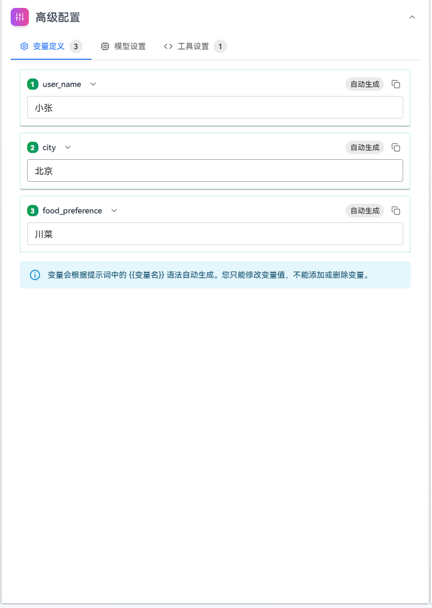

# 提示词管理快速入门

本指南将通过一个完整的示例帮助您快速了解提示词管理的主要流程，包括创建、编写、调试提示词和提交版本。
**示例背景：** 创建一个美食推荐专家，能够根据用户的口味偏好、所在城市等信息，推荐合适的美食和餐厅。

## 创建提示词
 
### 操作步骤

1. 进入提示词列表页面

导航到提示词管理页面，单击"创建提示词"按钮。

2. 填写基本信息

在弹出的对话框中填写提示词key，名称和描述：

| **参数** | **示例**   |
|-----|----------|
| 提示词Key | food_recommend_expert |
| 名称  | 美食推荐专家   |
| 描述  | 根据用户偏好和所在城市推荐美食和餐厅的助手 |


单击“创建”按钮。


3. 编写提示词内容

系统跳转到编辑页面后，在"编写提示词"模块中添加消息：

| **消息** | **含义**      |
|----|-------------|
| System消息 | 定义AI角色      |
| User消息 | 模拟真实用户输入    |

示例如下：
**System消息**：

```
你是一位专业的美食推荐专家，擅长根据用户的口味偏好和所在城市推荐合适的美食和餐厅。

你的工作原则：
1. 始终保持热情、友好的态度
2. 深入了解用户的口味偏好和需求
3. 提供详细、实用的美食推荐
4. 考虑价格、位置、口味等多方面因素
5. 如果信息不足，主动询问用户偏好

用户信息：
- 用户姓名：{{user_name}}
- 所在城市：{{city}}
- 口味偏好：{{food_preference}}
```

**User消息**：

```
我想在{{city}}找一家{{food_preference}}的餐厅
```

**Assistant消息**：

```
您好{{user_name}}！很高兴为您推荐美食。

根据您的偏好，我为您推荐以下餐厅：

1. **XX餐厅**（{{food_preference}}）
   - 地址：XX路XX号
   - 人均消费：100-150元
   - 特色：招牌菜、环境优雅
   - 评分：4.8/5.0

如果您需要更多信息或有其他要求，请告诉我。
```


4. 配置变量

在"高级配置" → "变量定义"标签页中，设置变量的默认值：

- 变量名：`user_name`， 默认值：`小张`
- 变量名：`city`，默认值：`北京`
- 变量名：`food_preference`， 默认值：`川菜`



5. 配置模型

在"高级配置" → "模型"标签页中：

- 选择模型：`deepseek-v3-250324`
- 设置参数值temperature：`0.7`、max_tokens：`2048`、top_p：`0.7`
  


6. 配置工具

在"高级配置" → "工具设置"标签页中，添加一个用于调用外部餐厅检索能力的工具：

- 单击"新增工具"按钮 
- 录入工具名称：`recommend_restaurant`，描述：`根据城市、口味和预算检索推荐餐厅`和入参配置：
     
| 字段              | 类型   | 描述                 | 是否必填 |
| ----------------- | ------ | -------------------- | -------- |
| `city`            | string | 用户所在城市         | 是       |
| `food_preference` | string | 用户的口味偏好       | 是       |
| `budget`          | number   | 人均预算（单位：元） | 否       |
     
     
- 输入默认模拟值：
   
```json
{
  "restaurants": [
    {
      "name": "蜀大侠火锅",
      "address": "朝阳区XX路XX号",
      "price_range": "120-180",
      "rating": 4.8
    },
    {
      "name": "川味小馆",
      "address": "海淀区XX路XX号",
      "price_range": "80-120",
      "rating": 4.6
    }
  ]
}
```


7. 调试提示词
在"提示词调试"模块中，输入测试消息，然后单击发送：

```
我想在北京找一家川菜餐厅
```


查看AI回复，确认效果是否符合预期，并验证工具调用：

- 查看模型返回的工具调用信息确认模型发起了工具调用，参数中包含`city`和`food_preference`。
- 观察工具返回的餐厅列表是否被模型吸收并体现在最终回答中。

8. 提交提示词

单击"提交新版本"按钮，输入版本号和版本描述，确认提交。


如果后续有更改，提交新版本时能看到和上一版本的差异。


