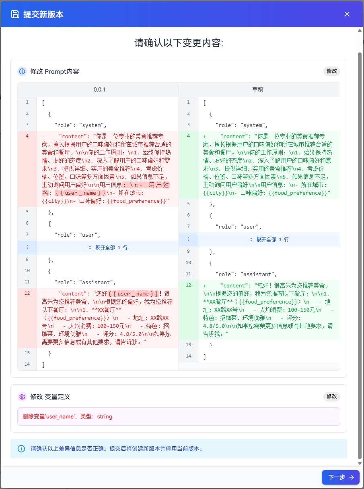
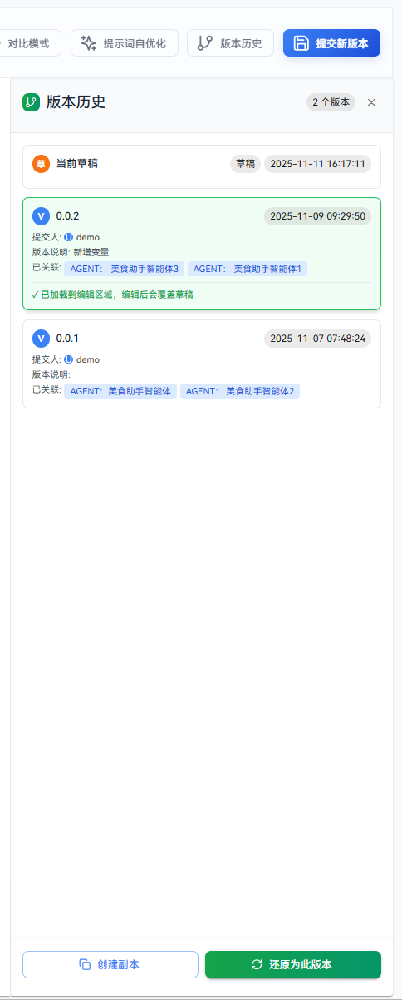
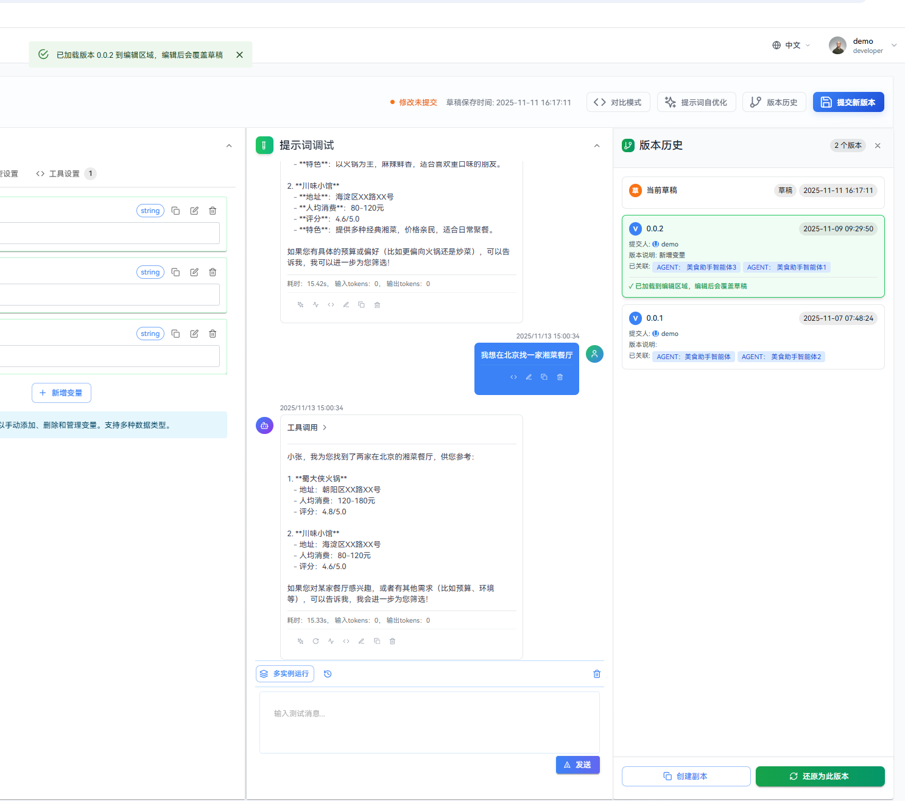
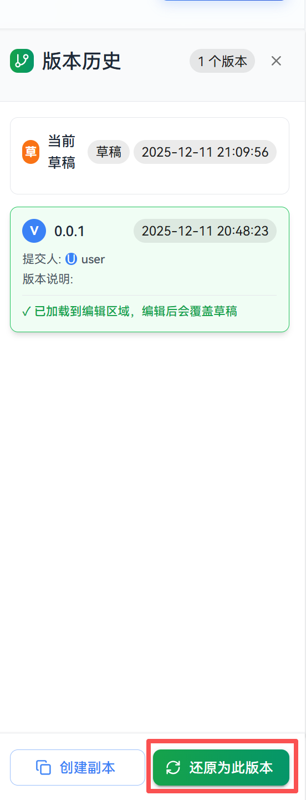
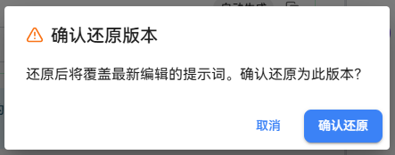

本指南详细介绍提示词的版本管理体系，包括正式版本提交流程、版本差异对比、历史版本查看与操作等功能，帮助您建立完整的提示词版本控制和协作流程。

# 提交新版本

## 操作步骤
1. 单击页面头部的"提交新版本"按钮，系统会自动获取当前草稿和最新正式版本的详细信息，如果当前已存在正式版本，系统会展示版本差异对比。

   

2. 如果已有正式版本，系统会展示详细的版本差异对比，系统会自动检测是否有实质性变更，如无变更则不允许提交。如果是首次提交新版本，不会展示差异对比。

   示例如下：

   

3. 确认差异后（或首次提交时直接进入此步骤），填写版本信息。

   提示词版本信息参数如下：

   | 参数名称 | 参数说明 | 限制 |
   |---------|---------|-----|
   | 版本号 | 输入符合规范的版本号 | 必填，最多50字符 |
   | 版本描述 | 填写版本更新说明 | 可选，最多200字符 |

   首次提交时填写版本信息示例图如下：

   

   非首次提交时填写版本信息示例图如下：

   

4. 单击"确认提交新版本"完成版本发布。

# 查看版本历史

版本历史会记录所有正式版本，便于追溯与协作。

## 操作步骤

1. 单击页面头部“版本历史”按钮，在弹出的面板中可查看各版本的发布时间、创建人及描述。
   
   

2. 选中某个版本，可以把版本信息加载到编辑区。选中草稿，可以把草稿信息加载到编辑区。

   

# 创建副本

## 操作步骤

1. 在历史列表选择目标版本。
2. 单击"创建副本"按钮。
3. 在弹出的对话框中填写新提示词的基本信息：

   

   创建提示词副本信息参数如下：

   | 参数名称 | 参数说明 | 默认值 |
   |---------|---------|-----|
   | 提示词标识 | 新提示词的唯一标识 | 原标识\_copy |
   | 提示词名称 | 新提示词的显示名称 | 原名称\_copy |
   | 描述 | 新提示词的描述信息 | - |
   
4. 单击“创建”按钮，创建新的提示词副本，并自动跳转到新的提示词副本编辑界面。

# 恢复版本

## 注意事项

- 还原后的提示词版本将覆盖最新编辑的提示词，请谨慎操作。

## 操作步骤

1. 在版本历史列表选择目标版本。
2. 单击"还原为此版本"按钮。

   
   
3. 单击“确认还原”按钮，确认还原到指定版本。

   

