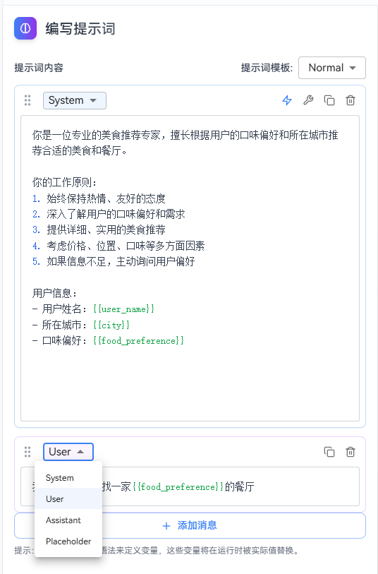

# 编写提示词

本指南详细介绍如何在系统中编写和配置提示词，包括提示词创建、基本信息编辑、消息模板构建、模板引擎与变量使用、模型参数设置以及工具配置等完整流程，帮助您创建高质量的提示词。

## 创建提示词

### 操作步骤
1. **单击创建按钮**：在页面右上角选择“创建提示词”。
2. **填写基本信息**：按要求填写提示词Key(提示词 Key 必须唯一，重复会导致创建失败)、提示词名称、描述字段。


3. **确认创建**：单击“创建”后，系统会新建一个提示词并跳转至编辑页面。


## 编辑提示词基本信息

### 操作步骤
1. 单击页面头部编辑基本信息按钮打开基本信息对话框。
2. 填写以下字段：

| **字段** | **要求**      |
|----|-------------|
| 提示词名称 | 必填，1-100 个字符      |
| 描述 | 可选，0-500 个字符      |

3. 单击"保存"，提示词的基本信息更新完成。


## 编写提示词模板

提示词模板支持四种消息类型，用于构建上下文支持复杂业务需求。这些消息类型基于现代大语言模型的对话架构设计，能够有效指导模型行为并提升输出质量。

### 操作步骤

1. 在“编写提示词”模块，单击消息列表底部的“添加消息”按钮。
2. 选择要添加的消息类型（System / User / Assistant / Placeholder）。
3. 编辑消息内容，可直接输入或粘贴已有文本。
4. 可拖拽消息实现排序，调整上下文关系。
5. 单击任意消息右上角的按钮可复制、删除该消息。



#### System 消息

- **核心作用**：定义模型角色、语气、风格与必须遵守的规则，作为模型的"身份证"和"行为准则"，在整个对话过程中持续生效。适用于界定模型的身份背景（客服、顾问、专家等）、约束核心职责和工作原则、规定语言风格与价值观、声明必须遵守或禁止的行为、设定输出格式和安全边界。
- **最佳实践**：
  - 明确定义角色身份（如"专业医生"、"技术专家"、"创意写手"）。
  - 明确任务目标（说明希望模型完成的具体事情和预期结果）。
  - 结构化表达（用标题、列表、分步骤等方式组织内容）。
  - 提供上下文（补充背景信息、历史记录或已有数据，帮助模型理解场景）。
  - 提供示例（给出示范回答或格式样例，让模型参考）。
  - 使用动态模板（结合变量或 Jinja2 模板，根据不同输入生成个性化内容）。
  - 设定回答风格（正式/非正式、简洁/详细、技术性/通俗化）。
  - 指定输出格式要求（JSON、Markdown、特定结构）。
  - 设置行为边界和限制（不能提供的信息类型、必须遵守的规则）。
- **实际应用示例**：

```
你是一位拥有 10 年以上互联网产品规划经验的资深产品经理，擅长拆解业务目标并输出高质量的产品方案。

核心职责：
- 对齐业务目标与用户价值，明确问题根因与成功指标
- 基于数据和调研洞察提出可执行的产品策略与交互方案
- 协调设计、研发、运营等角色推进方案落地

工作原则：
1. 表达专业、冷静，保持逻辑严谨与结论清晰
2. 先给出结论，再阐述 3 步以内的关键推理过程
3. 如信息不足，先列出所需补充数据或验证假设的方法
4. 优先引用经过验证的业内最佳实践或案例

输出要求：
- 统一使用 Markdown，结构为：标题 → 关键信息要点 → 建议/行动清单 → 风险与备选方案
- 行动项须包含负责人/协作方、时间节点、预期产出
- 若存在外部依赖或风险，需显式标注并提供缓解措施
```

#### User 消息

- **核心作用**：模拟真实用户输入，为模型提供任务上下文和触发条件，通常使用占位符 `{{query}}` 绑定具体内容，实现运行时的动态替换。适用于构造常见咨询、任务描述、问题提问等。
- **实际应用示例**：
  
| User提示词示例            | 用户输入   | 替换后的提示词                 |
| ----------------- | ------ | -------------------- | 
| 我是一名产品经理，现在遇到以下问题：<br> {{query}}<br><br>请结合产品设计的最佳实践，为我提供具体的解决方案和实施步骤。           | 我正在设计移动端APP的用户注册流程，请帮我设计一个用户体验良好的注册流程。 | 我是一名产品经理，现在遇到以下问题：<br>我正在设计移动端APP的用户注册流程，请帮我设计一个用户体验良好的注册流程。 <br>请结合产品设计的最佳实践，为我提供具体的解决方案和实施步骤。       |
  
  **说明**：通过 `{{query}}` 占位符，系统在运行时将用户的具体问题动态插入到提示词模板中，既保持了上下文的一致性，又实现了内容的灵活性。这种方式特别适用于需要处理多样化用户请求的场景。

#### Assistant 消息

- **核心作用**：一方面可以进一步指导模型以特定角色、风格或步骤的提示内容，补充和细化System消息的指导。另一方面可以与User消息一起构成少量的历史对话记录，为模型提供上下文。适用于角色强化、风格调整、对话历史、上下文延续。
- **最佳实践**：
  
  - 作为角色指导时，应与System消息保持一致，进一步细化行为规范。
  - 作为历史记录时，应提供真实的对话上下文，帮助模型理解当前对话状态。
  - 内容应简洁明确，避免与System消息产生冲突。
- **实际应用示例**：
  
| 示例名称 | 消息列表 | AI最终回答 |
|------------|-----------|-------------|
| 角色强化型Assistant消息 | **System消息**：<br>你是一名专业的心理咨询师，具有丰富的临床经验。<br><br>**Assistant消息**：<br>在回答时请遵循以下原则：<br>1. 始终保持专业、温和、非评判的态度<br>2. 使用开放性问题引导用户深入思考<br>3. 提供具体可行的建议和应对策略<br>4. 注意保护用户隐私，营造安全的对话环境<br>5. 必要时建议寻求专业医疗帮助<br><br>**User消息**：<br>我最近工作压力很大，经常失眠，不知道该怎么办。 | 我理解您现在面临的困扰，工作压力导致的失眠是很常见的问题。让我们一步步来分析和解决：<br>## 压力源分析<br>首先，能具体说说是什么工作因素让您感到压力吗？比如：<br>- 工作量过大？<br>- 人际关系紧张？<br>- 对工作结果的担忧？<br>## 失眠改善建议<br>**立即可行的方法**：<br>1. **睡前放松**：尝试深呼吸或冥想，帮助大脑从工作状态切换到休息状态<br>2. **规律作息**：即使失眠也要保持固定的上床和起床时间<br>3. **睡前1小时避免电子设备**：蓝光会影响褪黑素分泌|
| 历史记录型Assistant消息 | **System消息**：<br>你是一名美食推荐专家，擅长根据用户的口味偏好推荐地方特色美食。<br><br>**User消息**：<br>我上次去成都，特别喜欢那里的麻婆豆腐和担担面，麻辣的口感让我印象深刻。<br><br>**Assistant消息**：<br>成都的麻婆豆腐和担担面确实是川菜的经典代表！看来您对麻辣口味情有独钟。这种麻辣鲜香的口感体验确实让人难忘。<br><br>**User消息**：<br>我下个月要去湖南出差，听说湖南菜也很有特色，有什么好吃的推荐吗？ | 太好了！基于您对成都麻婆豆腐和担担面的喜爱，湖南菜绝对是您的菜！湘菜同样以麻辣著称，<br>但有着独特的"酸辣"风味，我为您推荐以下必尝美食：<br>## 湖南经典美食推荐<br>### 主菜类（与您喜爱的川菜口味相近）<br>**必尝推荐**：<br>- **剁椒鱼头**：湘菜招牌，酸辣开胃，鱼肉鲜嫩配上剁椒的香辣<br>- **麻辣子鸡**：类似您喜欢的麻辣口感，但湘式做法更突出干辣椒的香味<br>- **口味虾**：长沙特色，麻辣鲜香，虾肉Q弹配上浓郁汤汁<br>- **辣椒炒肉**：看似简单但极考验功夫，辣椒的香与肉的鲜完美融合<br>### 特色小食（口感层次丰富）<br><br>相信湘菜的酸辣风味会给您带来不同于川菜麻辣的全新体验！需要我推荐具体的餐厅地址吗？ |

**说明**：Assistant消息通过角色强化或历史记录的方式，帮助模型更好地理解当前对话的背景和期望，从而提供更加准确和连贯的回答。

#### **Placeholder 消息**

- **核心作用**：为动态内容预留位置，运行时由系统注入真实上下文，支持上下文感知的对话系统。适用于长对话场景、保留多轮交互历史、增强上下文记忆。
- **实际应用示例**：

| 消息列表 | 变量值 | 替换后的完整提示词 | AI最终回答 |
|------------|--------|--------------------------|-------------|
| **System消息**：<br>你是一名专业的旅行顾问，擅长根据用户的历史<br>偏好和对话记录提供个性化的旅行建议。<br><br>**Placeholder消息**：<br>conversation_history<br><br>**User消息**：<br> {{query}} |**Placeholder变量值**：<br>User：我上次去了西安，特别喜欢那里的历史文化氛围。<br>Assistant：西安确实是中华文明的重要发源地，您对哪些方面印象最深刻？<br>User：兵马俑的震撼和古城墙的厚重感让我印象深刻，下次旅行希望能有类似的历史文化体验。<br>Assistant：明白了，您偏好有深厚历史底蕴的文化景点，而不是现代化的商业景区。<br><br>**user消息变量值**：<br>query:"我计划下个月去北京旅行，希望体验历史文化，有什么推荐吗？"|System:你是一名专业的旅行顾问，擅长根据用户的历史偏好和对话记录提供个性化的旅行建议。<br>User：我上次去了西安，特别喜欢那里的历史文化氛围。<br>Assistant：西安确实是中华文明的重要发源地，您对哪些方面印象最深刻？<br>User：兵马俑的震撼和古城墙的厚重感让我印象深刻，下次旅行希望能有类似的历史文化体验。<br>Assistant：明白了，您偏好有深厚历史底蕴的文化景点，而不是现代化的商业景区。<br>User:我计划下个月去北京旅行，希望体验历史文化，有什么推荐吗？|  基于您对西安历史文化的喜爱，特别是对兵马俑和古城墙的深刻印象，<br>我为您推荐以下北京历史文化深度体验路线：<br>## 推荐目的地：北京<br>### 古都文化探索<br>**核心推荐理由**：如同西安兵马俑展现秦代军事文化，北京的古建筑群展现明清文化精髓。<br>**必游景点**：<br>- **天安门广场**：感受国家历史的庄严与厚重<br>- **八达岭长城**：体验"不到长城非好汉"的历史豪情 <br>- **明十三陵**：明代皇帝陵寝群，感受帝王陵寝文化<br>## 文化连接点<br>这个行程特别契合您的兴趣：<br>- **历史震撼感**：从西安兵马俑的军阵震撼到故宫的皇家气势，感受不同朝代的历史厚重<br>- **古建筑艺术**：从西安古城墙的防御功能到北京古建筑的礼制文化，体验中国古建筑的演变|

**说明**：通过Placeholder变量，系统能够动态注入用户的历史对话记录和偏好设置，使AI能够提供高度个性化和连贯的回答，而不是通用的标准回复。这种方式特别适用于需要上下文记忆的长期对话场景。

### 模板引擎与变量使用

根据提示词的复杂度，系统支持两种模板引擎模式。不同模式下变量的功能和使用方式有所不同：

- **Normal 模式**：默认模式，使用 `{{变量名}}` 进行简单变量替换，适用于80%的常规场景，学习成本低，性能快。在编写提示词里面用`{{}}`包裹的符合变量命名规范的变量，会自动在变量定义区域生成变量。
- **Jinja2 模式**：专业模板引擎，使用 `{{变量名}}` 语法，支持条件判断（``）、循环遍历（``）、过滤器等高级功能，适用于复杂业务逻辑。需要先在变量定义区域手工添加变量，才能用 `{{}}` 引用变量。

**模式选择建议**

| 对比项   | Normal 模式   | Jinja2 模式          |
| -------- | ------------- | -------------------- |
| 学习成本 | 低，简单易用  | 中等，需要学习语法   |
| 功能强度 | 基础变量替换  | 支持逻辑判断和循环   |
| 适用场景 | 简单提示词    | 复杂业务逻辑         |
| 性能     | 快速          | 稍慢（需要模板解析） |
| 维护性   | 易于维护      | 需要注意语法规范     |
| 推荐使用 | 80%的常规场景 | 20%的复杂场景        |


#### **Normal 模式**

**使用步骤**：

1. 在提示词消息中使用 `{{变量名}}` 插入占位符。
2. 在"高级配置 > 变量定义"中会自动添加对应的变量。
3. 填写变量的默认值。
4. 在调试模块验证变量是否正确填充。


**变量语法**：
使用双大括号 `{{变量名}}` 进行简单的变量替换

**示例**：

| 提示词模板 | 变量配置 | 替换后的提示词 |
|------------|------------------|------------------|
| 你好，{{user_name}}！今天是{{current_date}}。<br><br>您的会员等级是：{{member_level}}<br>账户余额：{{balance}}元 | user_name: "张三"<br>current_date: "2024年11月9日"<br>member_level: "黄金会员"<br>balance: 1580 | 你好，张三！今天是2024年11月9日。<br><br>您的会员等级是：黄金会员<br>账户余额：1580元 |

#### **Jinja2 模式**

**使用步骤**：

1. 在"编写提示词"模块切换到Jinja2模式。
2. 使用Jinja2语法编写提示词模板。
3. 在"高级配置 > 变量定义"单击"添加变量"按钮，在弹出的对话框中填写变量信息：
   - **变量名称**：符合命名规范（字母、数字、下划线、连字符，不能以数字开头）。
   - **数据类型**：选择String、Integer、Float、Boolean或Object。
   - **默认值**：填写变量的默认值。
4. 保存变量后，在提示词中使用 `{{变量名}}` 引用。
5. 在调试模块测试模板渲染结果，验证变量是否正确填充。
6. 变量管理：在变量列表中可查看、复制、编辑或删除变量（删除前确认提示词未引用该变量）。


**变量语法**：

- 变量输出：`{{ 变量名 }}`
- 条件判断：` ... `
- 循环遍历：` ... `
- 过滤器：`{{ 变量|过滤器名 }}`
- 访问对象属性：`{{ 对象.属性 }}` 或 `{{ 对象["属性"] }}`，访问列表元素可用 `{{ 列表[索引] }}`
- 注释：`{# 这是注释 #}`

**示例**：

| 类型 | 提示词模板 | 变量配置 | 替换后的提示词 |
|------|--------------|------------|------------------|
| **条件判断** | <br>优秀<br>  <br>及格<br> <br> 不及格<br>  | score: 85 | 及格 |
| **循环遍历** | <br>{{ loop.index }}. {{ item.name }} - {{ item.price }}元<br> | items: [<br> {"name": "苹果", "price": 3.5},<br> {"name": "橙子", "price": 4.2}, <br>{"name": "香蕉", "price": 2.8} <br>] | 1. 苹果 - 3.5元 <br>2. 橙子 - 4.2元 <br>3. 香蕉 - 2.8元 |
| **过滤器** | {{ text\|upper }}           {# 转大写 #}<br> {{ text\|lower }}           {# 转小写 #} <br>{{ list\|length }}          {# 获取长度 #} <br>{{ value\|default("默认值") }}  {# 设置默认值 #}<br> {{ number\|round(2) }}      {# 四舍五入 #} | text: "Hello World" <br>list: ["a", "b", "c"] <br>value: "" <br>number: 3.14159| HELLO <br>WORLD <br>hello world <br>3 <br>默认值 <br>3.14 |
| **访问对象属性** | {{ user.name }} <br>{{ user['email'] }} <br>{{ products[0].price }} | user: {"name": "用户", "email": "user@example.com"} <br>products: [<br> {"name": "智能音箱", "price": 299}, <br> {"name": "蓝牙耳机", "price": 199} ]| 用户 <br>user@example.com <br>299 |
| **综合示例** | 你好，{{ user_name }}！<br><br>  <br>欢迎尊贵的VIP用户！您享有以下特权：<br>  <br>- {{ privilege }} <br> <br> <br>您当前是普通用户，升级VIP可享受更多特权。<br>  <br><br> <br>您的账户余额充足：{{ balance }}元 <br> <br>您的账户余额：{{ balance }}元，建议及时充值 <br><br> 您的账户余额不足，请尽快充值<br>  <br><br>历史订单数量：{{ orders\|length }} <br>最近购买时间：{{ last_purchase_date\|default("暂无购买记录") }} | user_name: "李四" <br>is_vip: true <br>vip_privileges: ["专属客服", "优先发货", "积分翻倍", "生日礼包"] <br>balance: 2580 <br>orders: ["订单1", "订单2", "订单3", "订单4", "订单5"] <br>last_purchase_date: "2024年11月5日" | 你好，李四！<br><br> 欢迎尊贵的VIP用户！您享有以下特权： <br>- 专属客服 <br>- 优先发货<br> - 积分翻倍 <br>- 生日礼包 <br><br>您的账户余额充足：2580元 <br><br>历史订单数量：5 <br>最近购买时间：2024年11月5日 |

#### 模板引擎使用技巧

**切换模式注意事项**：

- 从Jinja2切换到Normal：所有逻辑语句（if/for等）会被当做普通文本处理
- 切换前建议备份当前提示词内容
- 切换后务必在调试模块重新测试
- 删除变量前先全局搜索，避免提示词引用失效

**变量命名规范**：

- **命名规则**：变量名仅支持字母、数字、下划线（\_）、连字符（-），且不能以数字开头
- **使用有意义的名称**：`user_name` 优于 `un`，`order_total_price` 优于 `price`
- **保持一致性**：统一使用下划线命名（如 `user_name`）或连字符命名（如 `user-name`）
- **区分大小写**：`UserName` 和 `username` 是不同的变量
- **有效示例**：`user_name`、`order-id`、`totalPrice`、`item_count_2024`
- **无效示例**：`用户名`（包含中文）、`user name`（包含空格）、`user.name`（包含点号）、`2024_year`（以数字开头）

**变量类型选择**：

- **String（字符串）**：文本内容，如姓名、地址、描述信息
- **Integer（整数）**：整数数值，如数量、年龄、订单数
- **Float（浮点数）**：小数数值，如价格、评分、百分比
- **Boolean（布尔）**：条件判断，如是否VIP、是否启用、是否完成
- **Object（对象）**：使用JSON格式配置结构化数据，可表示对象（如 `{"name": "张三", "age": 25}`）或数组（如 `["苹果", "香蕉", "橙子"]`）

## 模型设置

模型设置决定了提示词运行时使用的AI模型和相关参数，直接影响输出质量和效果。

### 选择模型

在"高级配置 > 模型设置"标签页的模型选择下拉框选择具体的模型，不同模型有不同的特点和适用场景，你可以根据模型描述和标签选择合适的模型。

### 配置参数

模型常见配置参数如下，不同的模型能配置的参数不同，具体以页面上能配置的为准：

- **Temperature**（温度）：控制模型输出的随机性和创造性
  
  - 范围：0.0 - 1.0
    - 低值（0.0-0.3）：输出更确定、保守、可预测，适合需要精确答案的场景（如数学计算、事实查询）
    - 中值（0.5-0.8）：平衡创造性和准确性，适合大多数对话场景
    - 高值（0.9-1.0）：输出更多样、富有创造性和随机性，适合创意写作、头脑风暴等场景
  - 建议：与 Top P 配合使用时，通常只调整其中一个参数
- **Max Tokens**（最大令牌数）：限制模型在单次生成中输出的最大标记数。控制生成文本的长度，防止输出过长或消耗过多资源。
  
  - 建议：根据实际需求设置，避免设置过小导致输出被截断
- **Top P**（核采样）：也称为 Nucleus Sampling，选择累计概率达到 p 的最小词集合进行采样。动态调整候选词的数量，平衡输出的多样性和质量。
  
  - 范围：0.0 - 1.0
    - 低值（0.0-0.3）：只考虑概率最高的词，输出更集中、确定
    - 高值（0.8-1.0）：考虑更多候选词，输出更多样
  - 建议：通常设置为 0.9-0.95，与 Temperature 配合使用时建议只调整其中一个


## 工具配置

工具配置允许模型在运行时调用外部工具，实现更强大的功能扩展。

>说明：提示词模块现在只是实现了模拟的工具调用，暂不支持实际调用工具。


### 操作步骤

1. 在"高级配置 > 工具设置"标签页打开"启用工具"开关，单击"新增工具"按钮。


2. 在弹出的对话框中填写工具信息：

- **工具名称**：工具的唯一标识符。
- **工具描述**：清晰说明工具的功能和用途，帮助模型理解何时调用该工具。
- **参数配置**：定义工具的输入参数，配置工具的参数名称、参数类型、是否必填和参数描述。
- **默认模拟值**：为工具配置默认的模拟返回值（文本或JSON格式），用于在调试模式下模拟工具调用的返回结果，便于测试工具调用的效果。

### 参数配置方式

系统提供两种参数配置方式。

**1. 可视化配置**

通过界面表单逐项配置工具信息,适合初学者和快速配置场景,每个工具参数需要配置以下信息：

- **参数名称**：参数的标识符，必须唯一。
- **参数类型**：支持String、Integer、Number、Boolean、Array等类型。
- **是否必填**：标记参数是否为必需。
- **参数描述**：说明参数的用途和格式要求。

**2. JSON格式配置**

直接编辑完整的JSON Schema格式：

- 支持复杂的参数约束和嵌套结构。
- 适合有经验的用户和复杂工具定义。
- 提供语法高亮和格式验证。

在JSON格式配置模式下，需要编写完整的JSON Schema，支持更丰富的验证规则：

| 类型关键字 | 说明 | 数据示例 |
|-----------|------|--------|
| string | 字符串类型。可以配合使用minLength、maxLength等关键字来进一步约束。 | `"Hello, world"`, `"open"`, `"用户名"` |
| number | 数值类型，包括整数和浮点数。可使用minimum/maximum（定义数值范围）等关键字约束。 | `25.5`, `3.14`, `100` |
| integer | 整数类型。约束关键字与number类型类似。 | `1`, `42`, `-10` |
| boolean | 布尔类型，值为true或false。 | `true`, `false` |
| array | 数组类型。需使用items关键字定义数组内元素的结构，可使用minItems/maxItems约束长度。 | `["apple", "banana"]`, `[1, 2, 3]` |
| object | 对象类型。需使用properties关键字定义其属性，用required数组列出必需属性。可选用additionalProperties控制对象是否允许包含未在properties中定义的额外属性 | `{"name": "张三", "age": 25}` |

完整的JSON Schema格式说明参见：https://json-schema.org/understanding-json-schema/reference/type。

> 说明：
> 1.在JOSN Schema定义中，可以通过将type的值设为一个类型数组（如 ["string", "integer"]），来允许参数符合多种类型之一。在本系统中，不支持类型数组。
> 2.本系统也不支持null类型。

**3. 配置切换**

- 可以在可视化配置和JSON配置之间自由切换。
- 切换时系统会自动进行格式转换。
- 建议先用可视化配置快速搭建，再用JSON配置精细调整。

> 说明：由于可视化配置只支持简单的配置方式，如果在JSON配置模式下配置了复杂的JSON格式（比如嵌套格式），切换到可视化配置只能把可视化配置支持的部分解析。如果编辑了可视化配置，再次切换回JSON配置后，会导致可视化配置不支持的部分丢失。


### 完整示例：餐厅推荐工具

1. **工具名称**：`recommend_restaurant`
2. **工具描述**：`根据城市、口味和预算检索推荐餐厅`
3. **入参配置**：
- **可视化配置**

| 字段              | 类型     | 描述                 | 是否必填 |
| ----------------- |--------| -------------------- | -------- |
| `city`            | string | 用户所在城市         | 是       |
| `food_preference` | string | 用户的口味偏好       | 是       |
| `budget`          | number | 人均预算（单位：元） | 否       |

- **JSON配置**
```json
{
  "type": "object",
  "properties": {
    "location": {
      "type": "object",
      "properties": {
        "city": {
          "type": "string",
          "description": "城市名称，如：北京市、上海市"
        },
        "district": {
          "type": "string", 
          "description": "行政区或商圈，如：朝阳区、陆家嘴"
        },
        "address_keyword": {
          "type": "string",
          "description": "地址关键词，如： near 地铁站、商场名称"
        }
      },
      "required": ["city"],
      "additionalProperties": false
    },
    "cuisine": {
      "type": "array",
      "items": {
        "type": "string",
        "enum": ["中餐", "西餐", "火锅", "烧烤", "粤菜", "川菜", "湘菜"]
      },
      "description": "偏好菜系，可多选"
    },
    "budget_per_person": {
      "type": "integer",
      "minimum": 0,
      "maximum": 2000,
      "description": "人均预算（元）"
    },
    "occasion": {
      "type": "string",
      "enum": ["日常用餐", "朋友聚会", "商务宴请",  "家庭聚餐", "生日庆祝", "公司团建"],
      "description": "用餐场合"
    },
    "min_rating": {
      "type": "number",
      "minimum": 3.0,
      "maximum": 5.0,
      "description": "最低评分要求"
    },
    "preferred_payment": {
      "type": ["string"],
      "enum": ["alipay", "wechat_pay", "credit_card", "cash"],
      "description": "偏好的支付方式"
    }
  },
  "required": ["location", "budget_per_person"],
  "additionalProperties": false
}
```

4. **默认模拟值**：

```json
{
  "restaurants": [
    {
      "name": "蜀大侠火锅",
      "address": "朝阳区XX路XX号",
      "price_range": "120-180",
      "rating": 4.8
    },
    {
      "name": "川味小馆",
      "address": "海淀区XX路XX号",
      "price_range": "80-120",
      "rating": 4.6
    }
  ]
}
```


