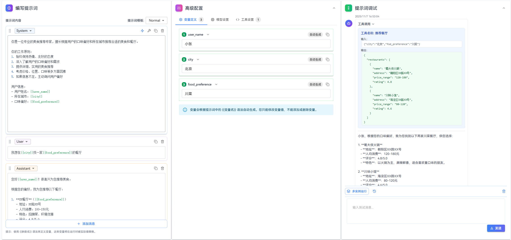
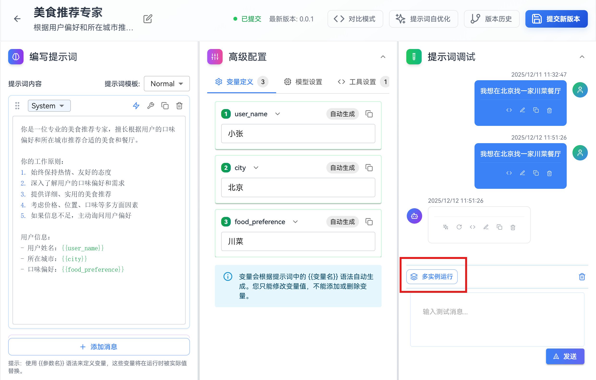
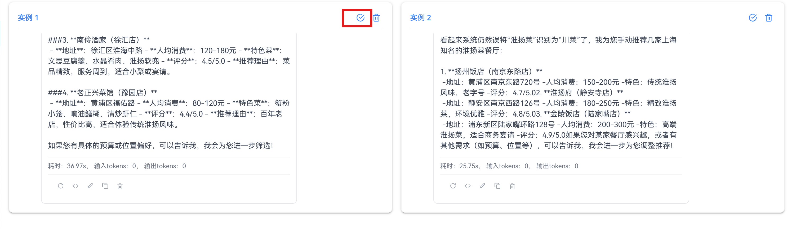
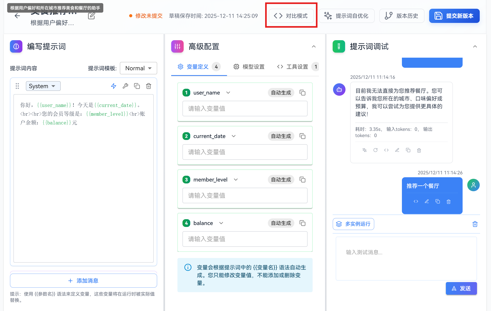

# 调试提示词

本指南详细介绍提示词的调试功能，包括普通调试模式、多实例运行模式、对比模式，帮助您全面掌握提示词的调试方法。

**1. 普通调试模式**：基础的调试方式，发送测试消息，查看AI回复，验证提示词效果。支持消息重试、编辑、复制等操作，便于快速迭代。适用于快速迭代（通过编辑和重试功能，快速调整和验证提示词）和问题排查（发现提示词存在的问题并进行修复）。

**2. 多实例运行**：同时运行多个实例，批量验证相同配置下的输出效果，横向对比不同实例的响应质量，验证提示词的稳定性。适用于稳定性验证（验证提示词在相同输入下的输出一致性）和批量测试（同时测试多个实例，快速评估提示词质量）。

**3. 对比模式**：创建基准组和对照组，在同一输入下对比不同提示词或配置的效果，快速找到最佳方案。支持独立编辑和测试，便于实验不同配置。适用于对比不同模型参数或提示词版本的效果，同时测试不同配置，通过横向对比找到最佳方案。


## 注意事项

- **关注模型参数**：不同模型或参数配置会显著影响回复质量，必要时在“高级配置”中调整后再调试
- **保持会话简洁**：调试时适度清理历史消息，避免上下文过长影响结果


## 1. 普通调试模式

方式一：在变量定义里面配置好变量的值后直接单击发送。这种方式适用于精准测试特定功能，快速验证逻辑，例如测试当用户输入特定关键词时，是否能正确调用某个插件。



方式二：在"提示词调试"模块中，输入测试消息，然后单击发送。这种方式适用于模拟真实用户对话，测试完整交互流程。
测试消息：

```
我想在北京找一家川菜餐厅
```


查看AI回复，确认效果是否符合预期。

## 2. 多实例调试模式

“多实例运行”适合批量验证相同配置下的输出效果，用于验证提示词的稳定性。

1. 单击提示词调试模块工具栏中的“多实例运行”按钮。



2. 在弹窗底部输入测试消息。


3. 单击发送，系统同时发起多个会话并展示结果。


4. 对比不同实例的响应质量。


5. 如果觉得某个实例运行的效果不错，可以单击采纳此实例的对话，把实例的会话历史添加到主页面提示词调试的会话历史里面。



## 3. 对比模式

对比模式可以对比评估不同配置下的提示词效果，快速找到最佳方案。

1. 单击页面头部"对比模式"按钮。

页面会切换为多栏布局，包含：
   - **基准组**：当前主版本。
   - **对照组**：可新增最多2组用于实验。
2. 单击"增加对照组"创建实验版本。

3. 对照组可单独编辑提示词与配置，互不影响。

4. 调试输入会在所有组同时运行，便于横向对比。


