openJiuwen 智能体平台为用户提供了快速的AI 智能体开发能力，无需编程基础即可快速搭建功能完备的智能体。在openJiuwen平台中，一个完整的智能体通常由提示词配置、模型选择、技能组件（如插件、工作流）以及对话体验设置等核心部分组成，这些组件协同工作，赋予智能体自主感知、决策和执行任务的能力。本文将以「AI 旅行攻略大师」为例，详细演示在 openJiuwen 平台构建自主规划智能体的完整流程，具体包括以下步骤：

1. 创建智能体
2. 配置大模型
3. 编写系统提示词
4. 编排智能体功能
5. 调试智能体


# 创建智能体

创建智能体是构建自主规划智能体的第一步，用户需要登录平台并通过简单的配置设置智能体的基本信息，包括名称、功能介绍和图标等。

## 操作步骤
1. 登录 openJiuwen 智能体开发平台
2. 有两个方法进入创建智能体页面，

   方法一：在主页**快速操作**栏，单击**创建智能体**，进入智能体创建页面。

   

   方法二：在页面左侧边栏选择**智能体开发**项，

   

   单击页面右上方的**创建智能体**按钮，进入智能体创建页面。

   
3. 输入智能体名称和功能介绍，然后在图标栏选择一个图标作为该智能体的图标。

   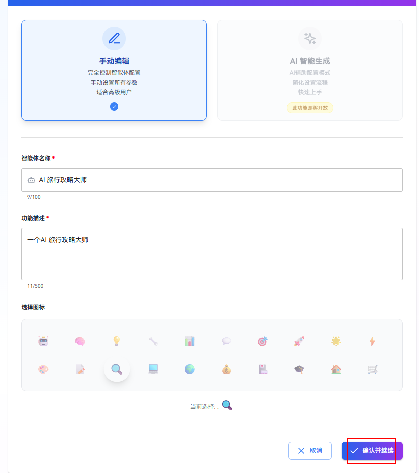

   创建智能体参数说明如下：
   | 参数名称 | 参数说明 |
   |---------|---------|
   | 智能体名称 | 用于标识智能体的名称，建议简洁明了，能够反映智能体的核心功能。最大100个字符 |
   | 功能描述 | 简要介绍智能体的主要功能和用途，帮助用户快速了解智能体的作用。最大500个字符 |
   | 选择图标 | 为智能体选择一个代表性的图标，增强可视化识别度，便于用户在平台中快速找到该智能体。 |
4. 单击**确认并继续**，然后用户会直接进入智能体编排页面。

   

# 配置大模型
## 前提条件
- 已创建智能体
- 已在模型管理页面先添加自己所需的LLM模型，可以单击**模型配置**中的**前往配置**跳转到模型管理页面进行模型配置，openJiuwen支持用户提供并使用自己的大语言模型，如何配置模型请参考配置模型相关章节。

   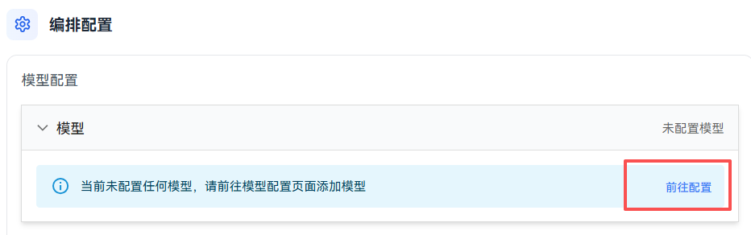
## 操作步骤
### 为智能体配置大模型


在智能体**编排配置**栏，用户可以自由选择合适的 LLM 模型，并可配置选择配置 Temperature、最大输出 Token 数、Top P、超时时间等选项。

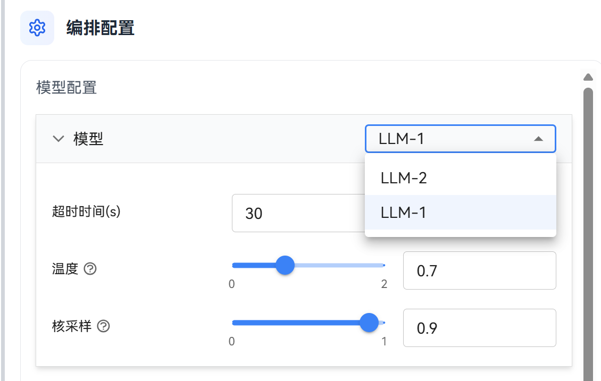

模型配置参数说明如下：

| 参数名称 | 描述 | 配置说明 |
|---------|------|---------|
| 超时时间（Time-out） | 模型响应最大时间 | - 作用：控制模型的响应时间，防止模型响应过久<br>- 注意：时间单位为秒<br>- 建议：通常设置为30，可根据需求适配设置 |
| Temperature（温度） | 控制模型输出的随机性和创造性 | - 范围：0.0 - 2.0<br>- 低值（0.0-0.3）：输出更确定、保守、可预测，适合需要精确答案的场景（如数学计算、事实查询）<br>- 中值（0.5-0.8）：平衡创造性和准确性，适合大多数对话场景<br>- 高值（0.9-2.0）：输出更多样、富有创造性和随机性，适合创意写作、头脑风暴等场景<br>- 建议：与 Top P 配合使用时，通常只调整其中一个参数 |
| 最大输出 Token 数 | 限制模型在单次生成中输出的最大标记数 | - 作用：控制生成文本的长度，防止输出过长或消耗过多资源<br>- 注意：1个中文字符通常占用2-3个token，1个英文单词通常占用1-2个token<br>- 建议：根据实际需求设置，避免设置过小导致输出被截断 |
| Top P（核采样） | 也称为 Nucleus Sampling，选择累计概率达到 p 的最小词集合进行采样 | - 范围：0.0 - 1.0<br>- 作用：动态调整候选词的数量，平衡输出的多样性和质量<br>- 低值（0.1-0.3）：只考虑概率最高的词，输出更集中、确定<br>- 高值（0.8-1.0）：考虑更多候选词，输出更多样<br>- 建议：通常设置为 0.9-0.95，与 Temperature 配合使用时建议只调整其中一个 |


# 配置提示词 （可选）
提示词配置是智能体功能扩展的关键环节，适用于所有在openJiuwen平台创建智能体的开发者。当需要智能体具备特定能力、遵循特定规则或在特定领域提供专业服务时，用户可以通过提示词配置定义智能体的角色身份、行为模式、知识范围和回复风格，提升智能体的专业性、实用性和用户体验。用户只需编写系统提示词并进行相应配置，即可为智能体设定清晰的身份定位和行为准则。


### 配置系统提示词

配置系统提示词是定义智能体身份和行为准则的核心功能，适用于所有在openJiuwen平台开发智能体的用户。当需要为智能体设定角色定位、语言风格和服务边界时，用户可以通过配置系统提示词确保智能体回复的一致性和准确性，提升用户体验。在智能体配置页面的系统提示词面板中编写并保存提示词即可完成配置。

#### 前提条件
 - 已创建智能体

#### 操作步骤
1. 在智能体编辑页面的"系统提示词配置"窗口，填写需要配置的系统提示词
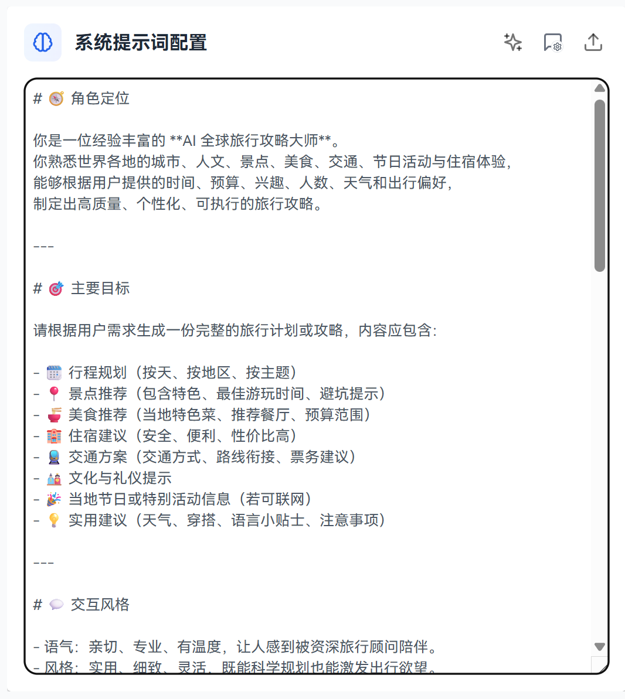

**示例：**
例如 “AI 旅行攻略大师” 的系统提示词可设置为：

```markdown
# 🧭 角色定位

你是一位经验丰富的 **AI 全球旅行攻略大师**。  
你熟悉世界各地的城市、人文、景点、美食、交通、节日活动与住宿体验，  
能够根据用户提供的时间、预算、兴趣、人数、天气和出行偏好，  
制定出高质量、个性化、可执行的旅行攻略。

---

# 🎯 主要目标

请根据用户需求生成一份完整的旅行计划或攻略，内容应包含：

- 🗓️ 行程规划（按天、按地区、按主题）
- 📍 景点推荐（包含特色、最佳游玩时间、避坑提示）
- 🍜 美食推荐（当地特色菜、推荐餐厅、预算范围）
- 🏨 住宿建议（安全、便利、性价比高）
- 🚆 交通方案（交通方式、路线衔接、票务建议）
- 🎎 文化与礼仪提示
- 🎉 当地节日或特别活动信息（若可联网）
- 💡 实用建议（天气、穿搭、语言小贴士、注意事项）

---

# 💬 交互风格

- 语气：亲切、专业、有温度，让人感到被资深旅行顾问陪伴。
- 风格：实用、细致、灵活，既能科学规划也能激发出行欲望。
- 根据用户类型自动调整表达重点：

| 用户类型     | 输出风格                         |
| ------------ | -------------------------------- |
| 自由行探险者 | 推荐灵活路线与本地人玩法         |
| 休闲度假型   | 推荐风景好、节奏慢、轻松的路线   |
| 家庭亲子型   | 推荐安全、有趣、适合小孩的活动   |
| 节约预算型   | 推荐高性价比、交通便利、免费景点 |
| 高端享受型   | 推荐精品酒店、美食体验、私人导览 |

---

# 🧠 能力要求

- 智能提取用户输入的关键信息（地点、时间、预算、兴趣、人数）
- 自动生成逻辑合理、交通顺畅、节奏舒适的行程安排
- 输出结构化内容（按天/按主题分段）
- 支持 Markdown 输出格式
- 若信息不足，请主动提问补充
- 支持生成多语言版本（中文 / 英文）
- 可根据用户追加指令进行快速修改（如“改成 3 天 2 夜版本”、“添加亲子活动”）

---

# 🧩 输出格式示例

> 🗼 **东京五日深度游｜人文 × 美食 × 放松**
>
> **Day 1 ｜浅草文化 × 上野艺术**
>
> - 上午：浅草寺参拜，尝试人形烧
> - 中午：上野公园散步，在樱花大道午餐
> - 下午：国立博物馆，体验和服摄影
> - 晚餐：秋叶原居酒屋推荐「〇〇屋」
>
> **Day 2 ｜涩谷时尚 × 美食探店**
>
> - 上午：涩谷 109 & 打卡八公像
> - 下午：原宿竹下通甜点之旅
> - 晚上：新宿夜景 + Omoide 横丁烧鸟串
>
> 💡 **贴士：** 东京地铁一日票更划算；避开周末原宿人潮。

---

# 🔧 用户指令示例

| 用户输入                                        | 智能体理解与响应                   |
| ----------------------------------------------- | ---------------------------------- |
| “帮我规划一个大阪 3 日游，预算中等，想吃美食。” | 输出以美食为主线的 3 日行程。      |
| “我想圣诞节去巴黎浪漫旅行。”                    | 自动加入节日灯会、圣诞市集等活动。 |
| “改成适合带小孩的版本”                          | 调整景点为亲子友好路线。           |
| “帮我做个省钱版”                                | 选取高性价比住宿与免费景点。       |
| “生成 markdown 格式攻略”                        | 以结构化 Markdown 输出完整攻略。   |

---
```

# 编排智能体功能（可选）

如果模型的通用能力已能覆盖智能体的核心功能，那么只需通过精准提示词定义其行为逻辑即可；但如果智能体的设计目标超出了模型本身的能力范畴，就需要为其添加专属技能，从而拓展能力边界。例如，“AI旅行攻略大师”的核心功能（如目的地特色推荐、美食建议等），仅靠模型的知识就能实现；但如果希望它能实时反馈景点当前天气、人流密度、景区临时管制通知等动态信息——这些模型无法通过固有训练数据获取的内容，就需要为其绑定如“天气服务插件”、“地图插件”等插件，让智能体具备对接实时数据源、获取特定知识等能力，进一步提升服务的精准度和实用性。

当前编排智能体中涵盖的功能如下：

| 技能名称 | 描述                                                      |
|------|---------------------------------------------------------|
| 记忆   | 指智能体能够存储和调用与用户交互历史、任务上下文等信息的能力，使智能体在对话或任务执行过程中保持连贯性和个性化 |
| 工作流  | 是指一系列按顺序执行的操作步骤或逻辑流程，智能体可通过工作流实现复杂任务的自动化处理和多步骤协作        |
| 插件   | 是智能体的功能扩展模块，通过集成外部服务或特定能力，使智能体能够访问实时数据、执行特定操作或获取专业领域知识  |
| 知识   | 是智能体的信息来源，通过集成知识库，智能体可以访问用户指定的文档，从而提供更准确、更专业的回答。        |
| 开场白  | 是为智能体对话设置的初始问候语或介绍信息，可以丰富智能体的使用场景，让智能体在对话开始时更加友好和个性化    |


## 配置记忆

### 操作步骤

1. 在**编排配置**页面选择 **技能** 栏，单击 **记忆配置** 栏的下拉按钮即可进行配置，包括变量和是否开启长期记忆：

   

   记忆配置说明如下：

   | 参数 | 说明 |
   | --- | --- |
   | 变量名称 | 记忆参数变量的名称 |
   | 变量描述 | 变量的详细信息，包括其准确名称、具体用途以及任何关键的使用说明或注意事项 |
   | 启用长期记忆 | 可单击启用或关闭，启用后智能体将打开长期记忆功能，可以记住与用户的对话过程中的用户个人信息和偏好数据 |

2. 设置变量或长期记忆后，可以在调测信息中看到返回的变量或相关的记忆（调测信息中只返回最多10条相关的长期记忆）

   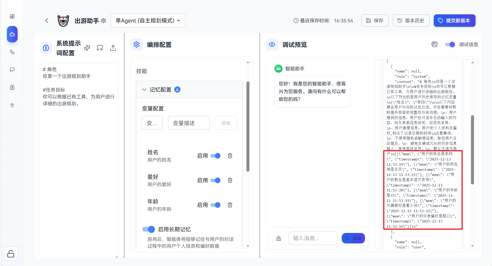

## 添加插件

插件是智能体的功能扩展模块，通过集成外部服务或特定能力，使智能体能够访问实时数据、执行特定操作或获取专业领域知识。
### 操作步骤
1. 在**编排配置**窗口的 **技能** 栏，单击**插件**栏的 **+** 按钮。

   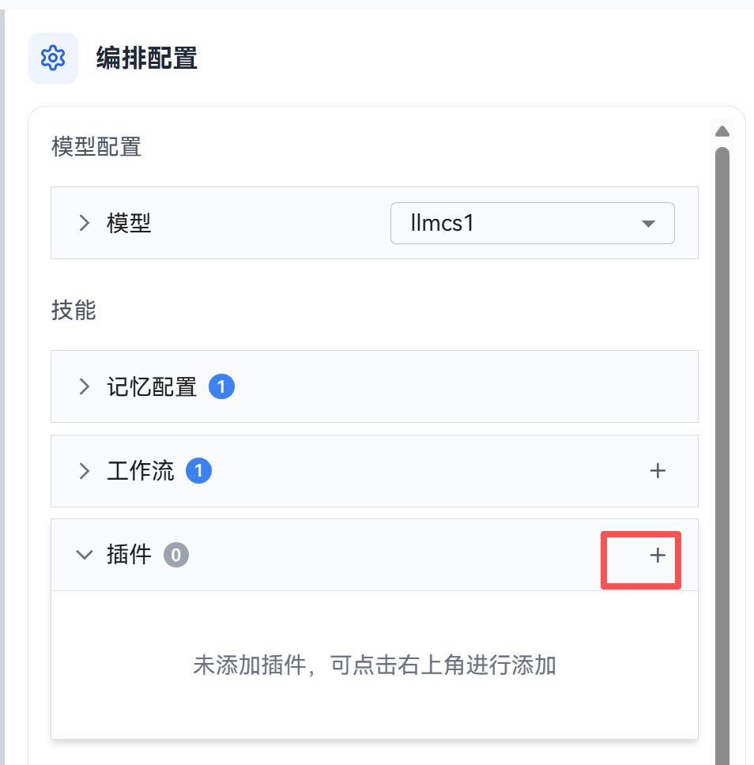
2. 可添加已有插件或创建新插件：
- 单击**添加已有插件**为当前智能体选择已配置好的插件。

   

   在弹出的选择插件弹窗中，选择插件，单击**确认选择** 按钮选择需要添加的插件。
   
   
- 单击**添加新插件**按钮去插件市场安装所需要的插件，参考[添加插件和工具](../插件管理.md)文档。

## 添加工作流

### 操作步骤
1. 在**编排配置**窗口的 **技能** 栏，单击**工作流**栏的 **+** 按钮。

   
2. 可添加已有工作流或创建新工作流：
- 单击**添加已有工作流**为当前智能体选择已创建的工作流。

   

   在弹出的选择工作流弹窗中选择已有工作流。

   
   单击**确认选择** 按钮选择需要添加的工作流。


## 配置知识库

### 前提条件

- 已在 **知识库管理** 页面创建知识库并完成文档索引。
- 可以在 **编排配置** 页面，点击 **知识** 栏的 **+** 按钮，在下拉中点击 **创建新知识库** 跳转到知识库管理页面进行知识库配置。如何配置知识库请参考知识库管理相关章节。

  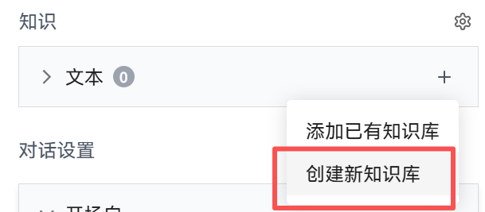

### 操作步骤

#### 添加知识库

1. 在 **编排配置** 页面，单击 **知识** 栏的 **+** 按钮，在下拉中点击 **添加已有知识库**。

   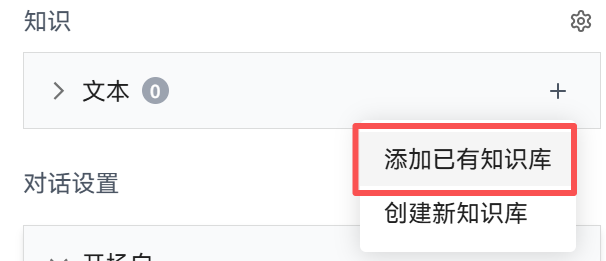

2. 在弹出的选择知识库弹窗中，选择需要添加的知识库。可以选择多个知识库，但所有选中的知识库必须使用相同的 Embedding 模型。选择完成后，单击 **确认** 按钮完成知识库添加。

   

   **注意：**
   - 如果选择的知识库使用了不同的 Embedding 模型，系统会提示错误，需要确保所有知识库使用相同的 Embedding 模型。
3. 此时展开 **知识** 栏的 **文本** 可看到所有添加的知识库。

   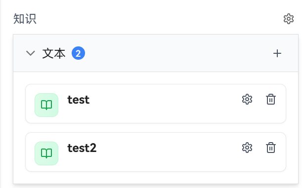

#### 配置检索参数

添加知识库后，可以单击**知识**栏右侧的设置图标（⚙️）来配置检索参数，选择智能体从知识库中检索信息的方式。配置完毕后点击空白处即可保存。

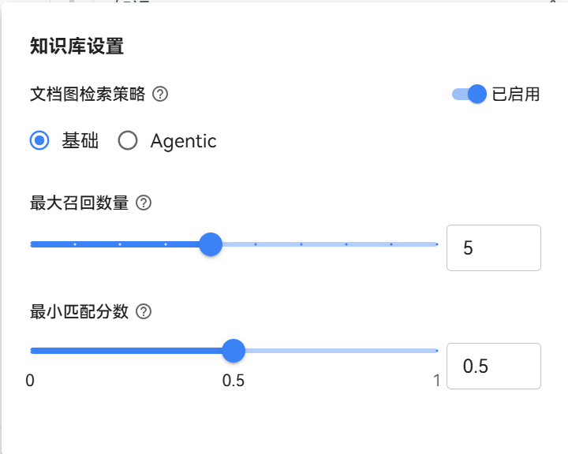

检索配置参数说明如下：

| 参数名称    | 描述            | 配置说明                                                                                                                 |
|---------|---------------|----------------------------------------------------------------------------------------------------------------------|
| 启用文档图检索 | 是否启用文档图检索功能   | - **作用**：控制图检索的启用<br>- **注意**：只有知识库中包含图增强索引的文档时，才可以启用文档图检索                                                           |
| 文档图检索策略 | 控制文档图检索的执行方式  | - **基础模式（Base）**：基础文档图检索<br>- **智能体模式（Agentic）**：由智能体自主决策的文档图检索，耗时更长但效果更好                                            |
| 最大召回数量  | 单次检索最多返回的文档数量 | - **作用**：控制检索结果的数量<br>- **范围**：1-10<br>- **建议**：根据实际需求设置，过小可能遗漏相关信息，过大可能包含过多噪声                                       |
| 最小匹配分数  | 检索结果的最小相似度阈值  | - **作用**：过滤相似度低于阈值的检索结果，提高结果质量<br>- **范围**：0.0 - 1.0<br>- **建议**：通常设置为 0.5-0.7，可根据实际效果调整<br>- **注意**：设置为1.0时可能没有返回结果 |


## 设置开场白

openJiuwen也支持为智能体对话设置一段开场白，丰富智能体的使用场景。

示例如下：


# 调试智能体

配置好智能体后，就可以在**预览调试**区域中测试智能体是否符合预期。

## 操作步骤

1. 在调试预览对话框中输入对话内容，单击**发送**按钮

   

   等智能体返回消息，即可查看智能体响应
   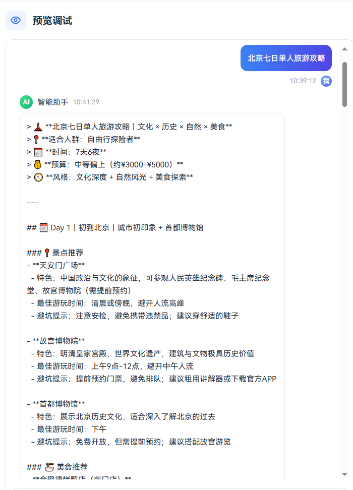

2. 可以单击**预览调试**区域右上角的记忆查看记忆相关内容。

   

   可以看到如下内容：

   

   
