# 插件管理

在openJiuwen平台中，插件是扩展工作流与智能体能力的关键方式。平台支持三种插件类型：本地自定义服务端、外部API调用，以及代码插件。每个插件可包含多个工具，且这些工具必须属于同一域名。每个工具对应独立的API。

# 添加插件与工具

在openJiuwen中，您可以通过以下两种方式添加插件：

`云侧插件：基于已有服务创建`：连接已有的服务，可以是您在本地通过[后台运行插件服务](#后台运行插件服务)运行的自定义插件服务，也可以是符合RESTful格式的外部API。

`本地代码插件：手动创建`：以编写代码的方式自定义插件工具，通过[启动本地沙箱服务](../../2.安装指导/本地安装/Windows系统安装.md#windows-sandbox)运行代码插件。

## 方法1：基于已有服务创建插件

### 前提条件
1. 需要有已部署好插件服务，且请求URL和请求参数信息已知，如用户需要自己部署插件服务可参考[后台运行插件服务](#后台运行插件服务)章节进行部署。

### 示例
假设用户有一个已部署的天气插件服务，插件参数可以设置api-key（示例为：1234567890）等公共参数，其URL为https://example.com/plugin/weather。其获取指定地点天气的接口路径为：/weather/current，服务接口为GET方法，通过请求query中的loacation字段指定地点，可获取该地点的天气信息，用户可以基于该服务URL创建插件。

### 添加插件操作步骤
1. 登录openJiuwen平台。

2. 进入平台左侧导航栏的**插件管理**模块。

3. 单击**安装插件**按钮，选择**云侧插件-基于已有服务创建**。
   
   

4. 填写云侧插件信息，单击”创建插件”按钮，完成插件创建。

   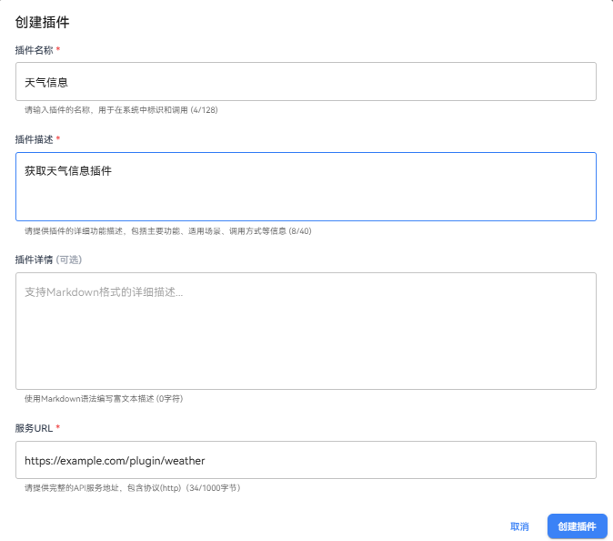

   
   创建云侧插件配置如下：
   
   | 配置项   | 说明                           |
   |:-----:|:---------------------------- |
   | 插件名称  | 插件的显示名称，用于识别插件               |
   | 插件描述  | 插件的功能描述，帮助用户了解插件的用途          |
   | 插件详情  | 插件的详细描述，支持markdown格式，帮助用户了解插件的详细配置方式          |
   | 服务URL | 插件对应的服务基础URL，插件将通过该URL调用服务接口 |


5. 创建完成后，进入插件配置页面，可修改基本配置、配置插件中的工具、或者配置插件参数。

   

6. 点击**插件参数**创建插件参数：

   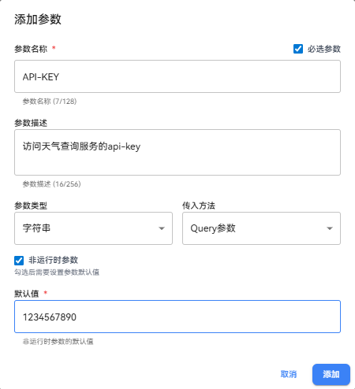 

   注释：
   - 插件参数可以设置公共参数，如api-key等，这些参数在调用插件服务时会自动添加到请求参数中。
   - 插件参数可以设置非运行时参数，此时会要求设置默认值，Agent或者工作流在调用插件时不用填写输入，且看不到该参数，默认值会被使用。
   - 必填参数：插件参数可以设置为必填参数，此时在调用插件时必须填写该参数，否则会报错。

### 添加工具操作步骤

1. 点击工具设置模块，点击**添加工具**
   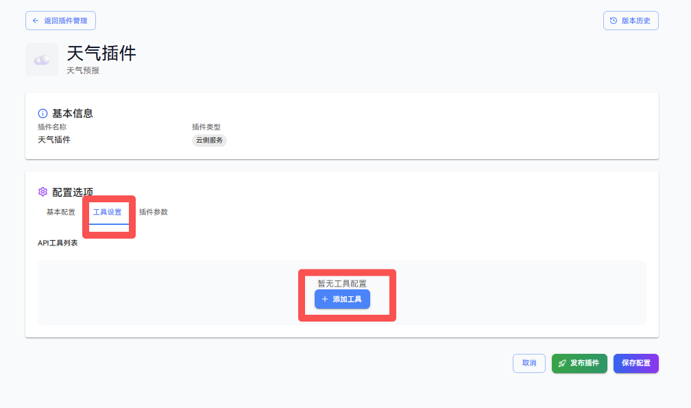

2. 填写工具信息：

   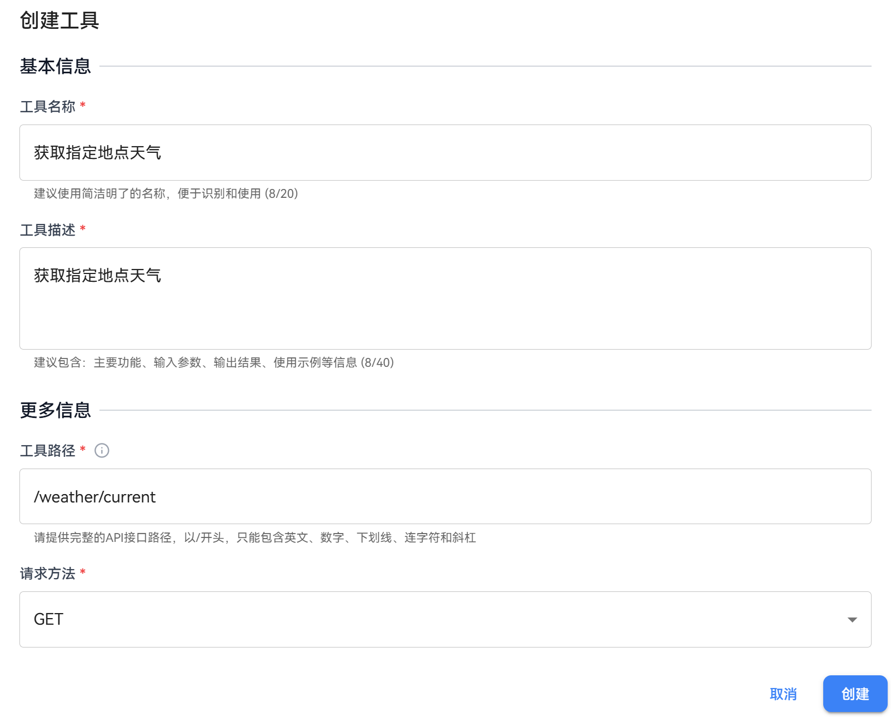

   **填写创建工具信息：**
   
   | 配置项   | 说明                                                                                                                           |
   |:-----:|:---------------------------------------------------------------------------------------------------------------------------- |
   | 工具名称  | 输入工具的显示名称                                                                                                                    |
   | 工具描述  | 描述工具的功能                                                                                                                      |
   | API路径 | 输入具体的API端点路径<br>例如：如果服务URL是 `http://localhost:8000`<br>天气查询API路径为 `/weather`<br>完整URL将是 `http://localhost:8000/weather` |

3. 添加工具输入参数：

   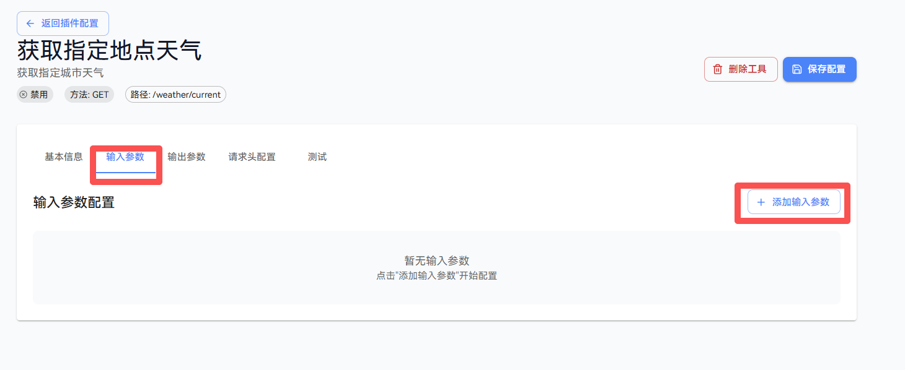

   工具输入参数示例如下：

   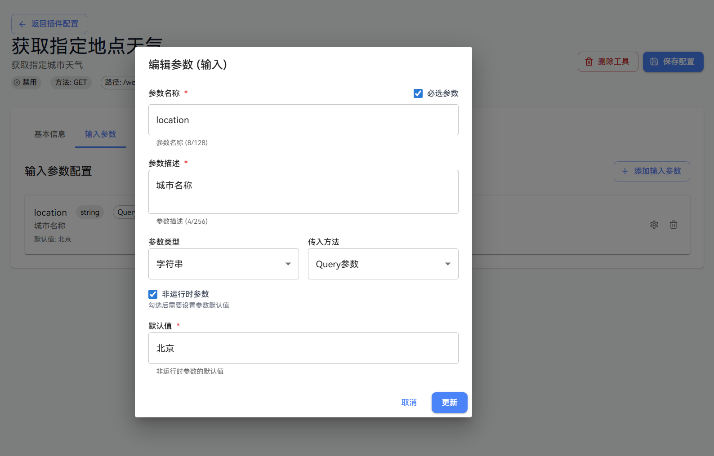   
   
   **输入参数配置**

   |  配置项   | 说明                                         |
   |:------:|:-------------------------------------------|
   |  参数名称  | 参数的标识符                                     |
   |  参数描述  | 参数的作用说明                                    
   |  参数类型  | 字符串, 整数, 浮点数等                              |
   |  传入方式  | GET支持Query、Header, POST支持Query、Header、Body |
   |  必需参数  | 是否为必填项                                     |
   | 非运行时参数 | 勾选后需要设置参数默认值，每次使用都默认读取默认值为实际入参             |

   添加好输入参数示例如下：
   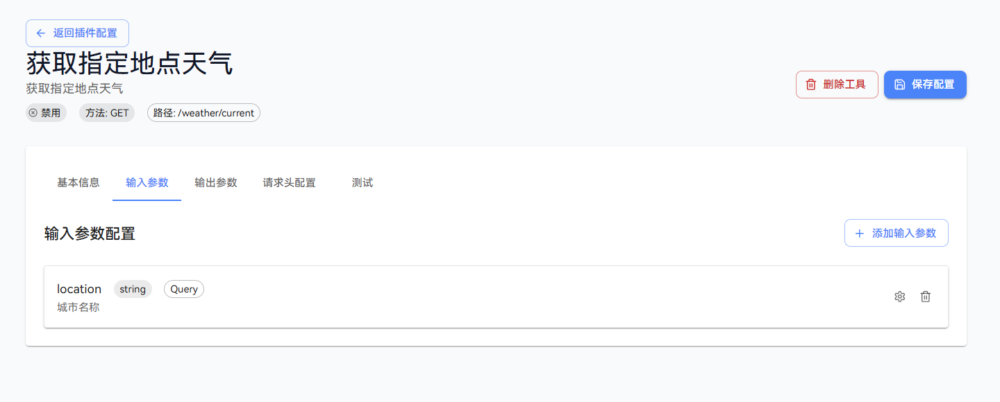

4. 创建好插件和工具之后，可进行插件和工具测试，点击**测试**模块，输入需要的参数，点击**执行测试**按钮：

   

   如果测试结果为`success`，则工具的状态会改变为`启用`，如何继续对工具的参数或代码进行修改，则工具状态会改变为`禁用`。

5. 其他参数设置
 
   **输出参数配置**
   
   | 配置项  | 说明                      |
   |:----:|:----------------------- |
   | 字段名称 | 返回数据的字段名                |
   | 字段类型 | string, number, object等 |
   | 字段描述 | 字段含义说明                  |
   
   **请求头配置**
   
   | 配置项    | 说明                             |
   |:------:|:------------------------------ |
   | 自定义请求头 | 可以设置自定义HTTP请求头                 |
   | 支持的标准头 | Content-Type、Authorization等标准头 |

6. 插件和工具创建完成，可在插件管理页面的**已安装**插件列表中对已创建的插件进行管理。

## 方法2：手动创建本地代码插件
openJiuwen 支持手动创建本地代码插件，用户可以直接编写代码（当前支持Python、JavaScript），编写好的代码作为插件提供用户使用。

### 操作步骤
1. 登录openJiuwen平台。

2. 进入平台左侧导航栏的插件管理模块。

3. 单击”安装插件”按钮，选择"本地代码插件-手动创建"。
   
   

4. **填写插件信息**，说明如下：
   
   | 配置项    | 说明                          |
   |:------:|:--------------------------- |
   | 插件名称   | 插件的显示名称，用于识别插件              |
   | 插件描述   | 插件的功能描述，帮助用户了解插件的用途         |

5. 单击”创建插件”按钮，创建插件进入插件编辑页面。
   
   

6. 在“配置选项”的“工具设置”中，单击“添加代码工具”按钮，添加代码工具。   

   

7. 在“创建工具”对话框中，填写工具信息，在代码编辑框中编辑代码（请按照代码模版的实例编辑main函数和输入输出参数），填写完单击“创建”按钮，填写信息说明参数如下：

   | 配置项    | 说明                          |
   |:------:|:--------------------------- |
   | 工具名称   | 工具的显示名称，用于识别工具              |
   | 工具描述   | 工具的功能描述，帮助用户了解工具的用途         |
   | IDE运行时 |  代码执行的语言环境，当前支持Python、JavaScript |

   

8. 创建工具后，自动跳转到插件工具配置页面，可以配置工具的基本信息，设置输入输出参数，设置执行代码，进行测试。

   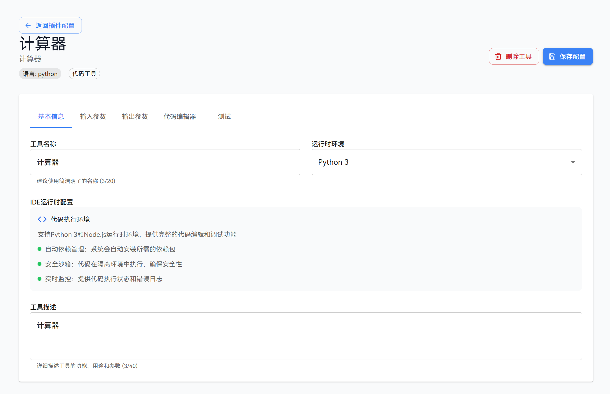

### 示例
假设用户希望自己设计一个自定义计算器插件，插件功能为实现自定义的运算符运算。
创建本地代码插件的示例如下：


创建代码工具配置的示例如下：
1. 点击代码模版获取代码示例：

   代码模版：
   ```python
   def add_test(a: int, b: int):
       return a + b
   
   # main函数为固定格式
   # 您可以通过 'args.params' 获取工具中的输入变量，Args为沙箱内置函数
   # 输出变量为固定模版：{'output_name': output}
   def main(args: Args):
     a = args.params['add1']
     b = args.params['add2']
     c = add_test(a, b)
   
     return {'res': c}
   ```
2. 点击创建后，编辑输入参数，按照代码示例中，输入有两个参数，一个是`add1`,一个是`add2`,类型都是`int`。
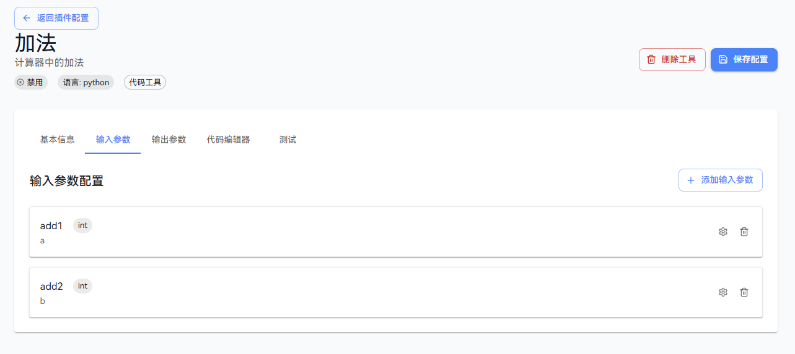

3. 编辑输出参数，按照代码示例中，输出有一个参数`res`,类型为`int`。
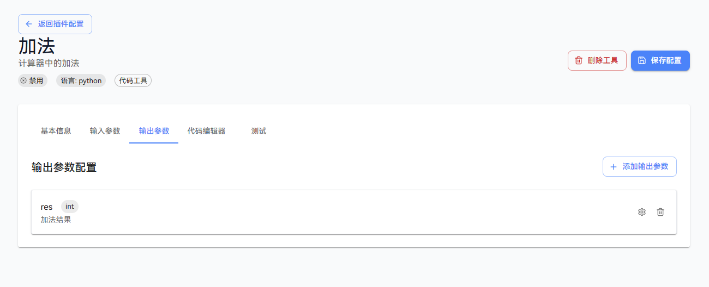

4. 点击保存配置后，点击测试页面中的`开始测试`按钮，输入内容，点击`执行测试`，得到测试结果。
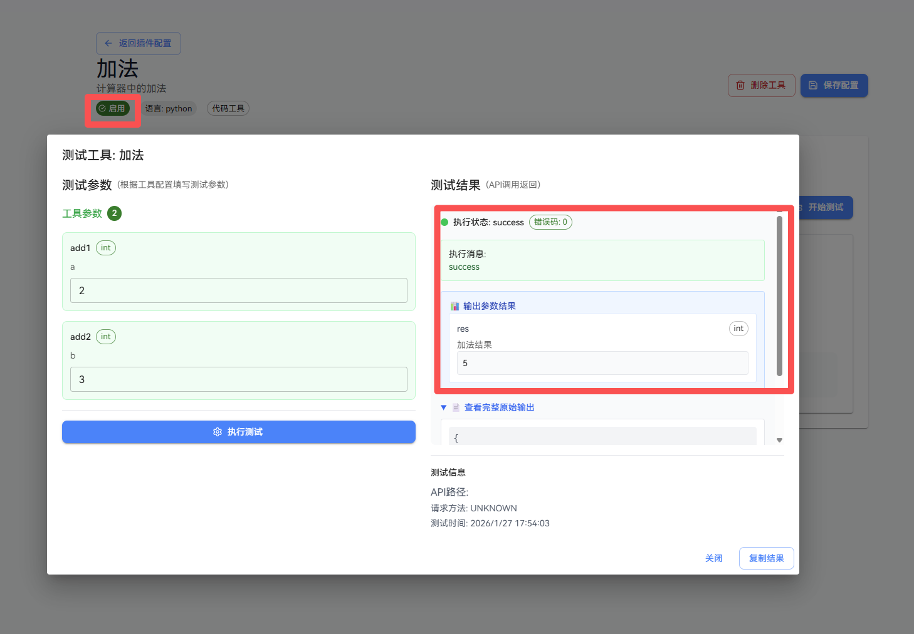
如果测试结果为`success`，则工具的状态会改变为`启用`，如何继续对工具的参数或代码进行修改，则工具状态会改变为`禁用`。

# 后台运行插件服务
如果用户需要自定义插件，可参考当前openJiuwen studio后端的代码示例：`agent-studio/plugin_server`，后台运行插件服务，然后在安装插件的时候即可选择后台运行的插件。

## 操作步骤

1. 参考plugin_server/routers/demo_router.py代码，编写插件工具的接口信息和业务处理逻辑。
   
      ```python
      from fastapi import HTTPException, Query
   
      from . import BasePluginRouter
   
      demo_router = BasePluginRouter(
          name="demo",
          description="your_demo_tool_description",
      )
   
      @demo_router.router.get("/run")
      async def run_demo(
          query: str = Query(..., description="query parameter description")
      ):
          try:
              return {
                  "result": "success",
                  "query": query,
              }
          except Exception as e:
              raise HTTPException(
                  status_code=500,
                  detail=f"run failed: {str(e)}"
              ) from e
   
      # 注册端点信息
      demo_router.register_endpoint("GET", "/run", run_demo, "run demo")
      ```

   当前plugin_server/routers/demo_router.py代码定义了一个/demo/run GET接口，该接口接受一个query参数，
   返回success及query参数值。

2. 参考plugin_server/run_restful.py代码，启动自定义插件服务服务。
   ```python
   import uvicorn
   from dotenv import load_dotenv

   from restful_tool_router import app

   # Load environment variables from .env file
   load_dotenv()

   # 定义 main 函数（供脚本入口调用）
   def main():
      # 尝试多种启动方式
      try:
         # 方法1: 标准方式
         uvicorn.run(app, host="0.0.0.0", port=8185)
      except TypeError as e:
         if "loop_factory" in str(e):
               # 方法2: 兼容方式
               import asyncio
               config = uvicorn.Config(app, host="0.0.0.0", port=8185)
               server = uvicorn.Server(config)
               asyncio.run(server.serve())
         else:
               raise

   if __name__ == "__main__":
      main()
   ```

   需要指定host和port，默认值分别为0.0.0.0和8135。
   
3. 如需要调用该接口，在创建云侧插件弹窗中配置插件url为http://localhost:8185

   

   配置好接口信息，为插件添加一个/demo/run工具，测试结果示例如下：

   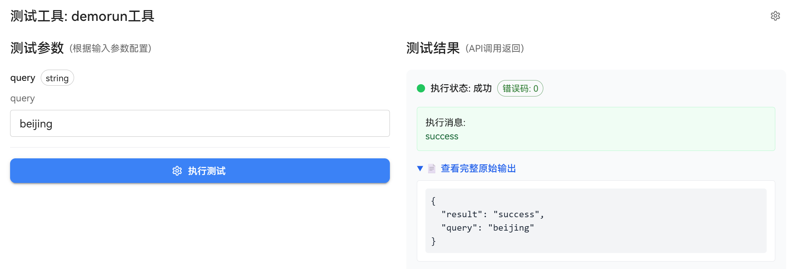
