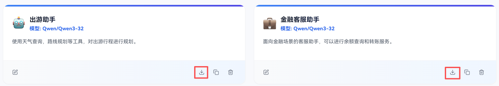
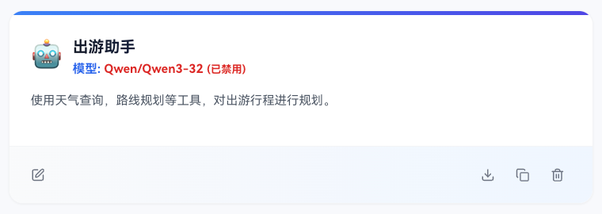
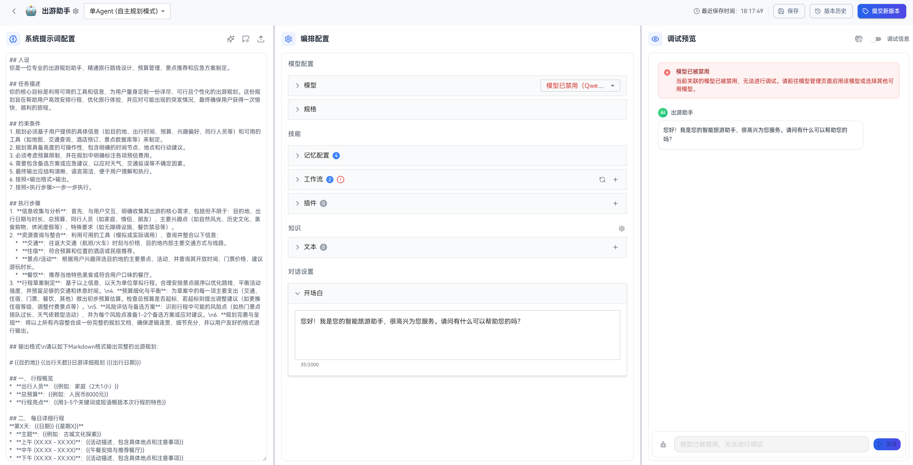
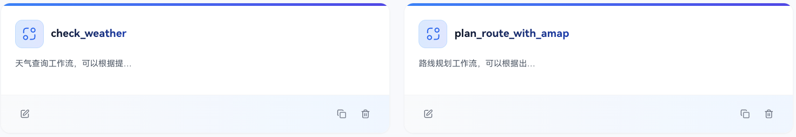
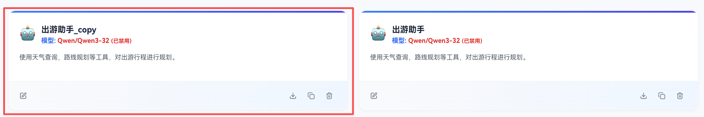
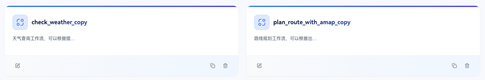

# Agent导出导入

在openJiuwen平台中，智能体导入导出可支撑智能体跨账户、跨平台的无缝迁移，方便用户智能体的部署和使用。

智能体导出时，会将目标智能体的所需基础配置信息和组件（工作流、插件、知识库）一并导出为一个json或zip文件。智能体导入时，系统会读取智能体配置文件，并把智能体配置信息写入到当前用户空间下。

## 智能体导出

智能体导入方式十分简单：在智能体列表页—目标智能体卡片栏，点击`导出`按钮，即可自动生成一个json或者zip文件（智能体带知识库文本信息将导出为.zip文件）。另外，导出时，会屏蔽掉模型配置中的`api_key`和`api_url`等敏感信息。

## 智能体导入

导入智能体：智能体开发页面-点击`导入`按钮：

**1. 跨账号/平台导入**

跨账号/跨平台导入时由于不存在冲突的可能性，所以会直接在当前用户空间创建新的智能体及其依赖项（工作流、插件、知识库）。如图：

智能体依赖的工作流导入案例：

由于不同用户、不同平台下，用户的模型配置会有不同，所以导入后的智能体需要**重新配置模型**信息，包括随智能体导入的工作流中的大模型节点、提问题节点、意图识别等节点。

如果智能体中包含知识库，为保证导入知识库的可用性，需要用户**提前配置好所需的`embedding model`和`milvus服务器`**。如缺少对应的embedding模型，导入时不会创建对应知识库；如没有milvus服务，则知识库会建立索引失败，导致知识库不可用。

**2. 同平台同账号导入**

同平台同账号导入时，会产生智能体及其依赖项的ID冲突，前端会弹窗提示用户是否覆盖现有智能体或者创建新副本：

* 覆盖现有智能体：即根据导入的智能体配置信息，对现有智能体进行覆盖写入。
* 创建副本：即根据导入的智能体配置信息，创建一个新的智能体及其所有依赖的副本，副本会在当前名字后加`'_copy'`

创建副本后智能体及其依赖工作流示例如图：

