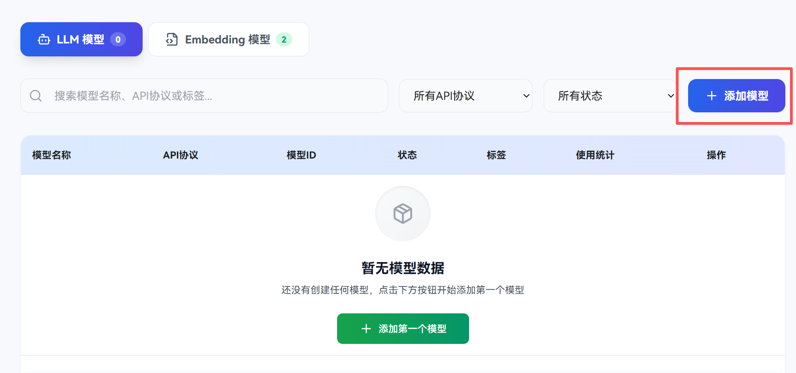
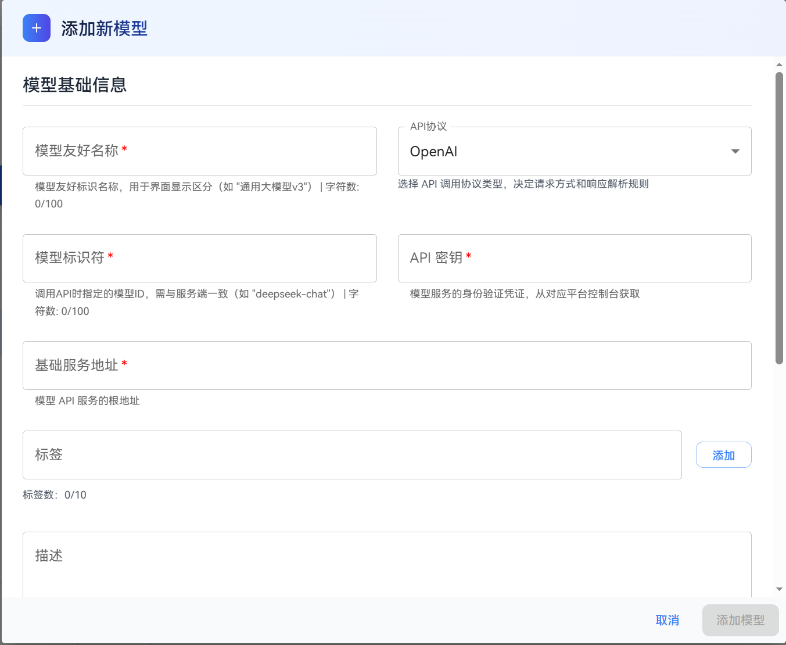
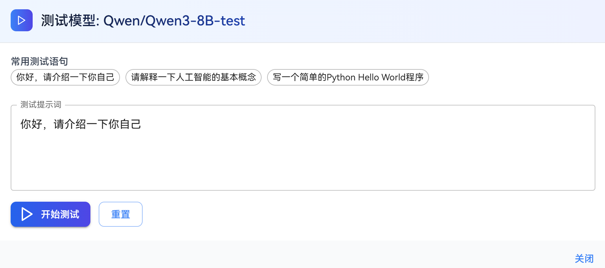
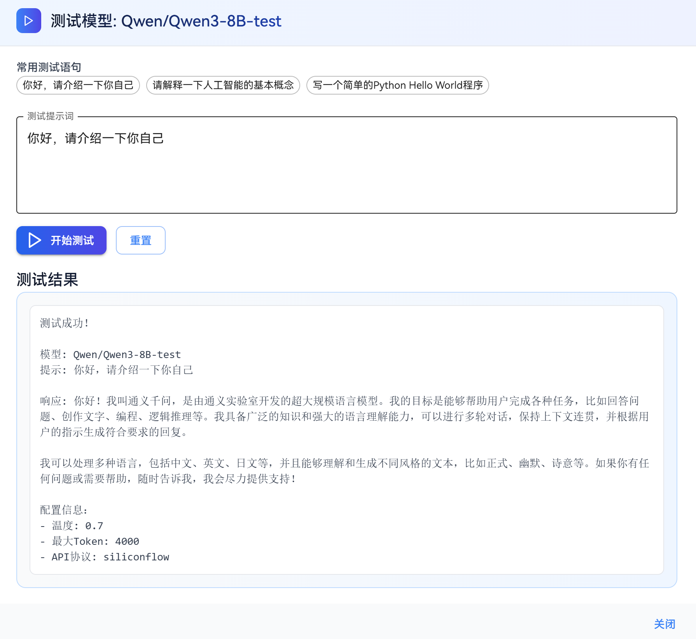
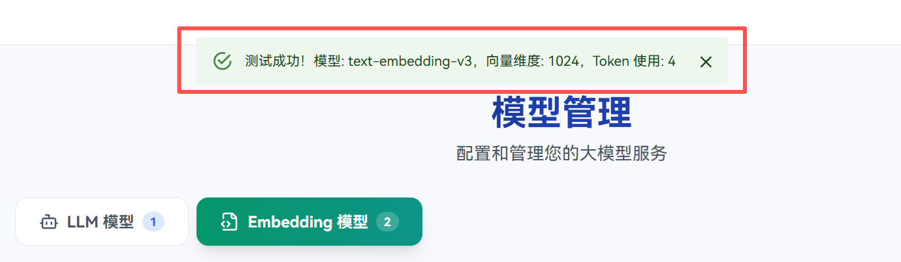
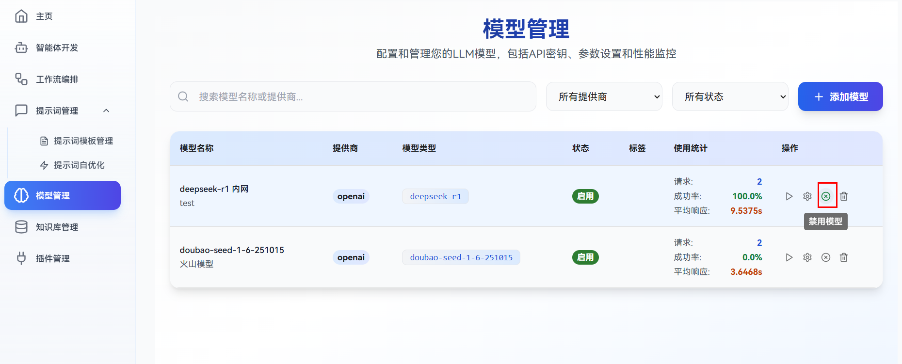
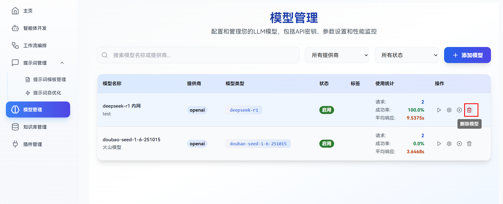

# 管理模型

openJiuwen Studio模型管理主要支持：添加模型、测试模型、编辑模型配置、禁用/启用模型、删除模型的操作。包含LLM模型与Embedding模型。
具体操作指导如下：

# 添加模型

## 前提条件

1. 已获取模型服务对应的 ​**API URL**​（模型服务的调用地址）；
2. 已获取模型服务的 ​**API 密钥**​（若服务需要身份验证，通常从服务提供商控制台获取）；
3. 已确认模型服务的 ​**API 调用协议**​（如业界通用的OpenAI Chat Completion、Anthropic Claude 等）与平台支持的协议类型匹配；

## 操作步骤

1. 登录openJiuwen平台
2. 进入平台左侧导航栏的**模型管理**模块；
3. 选择要添加的模型类型(LLM模型或Embedding模型)；<br>
   
4. 单击页面右上角的**添加模型**按钮；<br>
   
5. 在弹出的配置界面中，设置相关参数。<br>
   

   **参数说明**
   
   | **参数**     | **所属组件**    | **说明**                                                                                                                  |
   |------------|-------------|-------------------------------------------------------------------------------------------------------------------------|
   | 模型友好名称     | 通用          | 自定义的模型友好标识名称，用于平台界面显示区分，方便用户快速识别。<br>示例：`通用大模型v3`/ `表征模型v3`                                                             |
   | 模型标识符      | 通用          | 调用API时指定的具体模型标识符ID，需与服务端一致。<br>例如：`gpt-3.5-turbo` / `text-embedding-v3`                                                 |
   | API 协议     | 通用          | API调用协议类型，决定请求格式、认证方式和响应解析规则。<br>应与模型服务提供商保持一致例如，OpenAI指的是 Chat/completion API 协议                                       |
   | API密钥      | 通用          | 模型服务的身份验证凭证（API Key），通常可以从模型服务的控制台获取，填写后将自动加密存储。 <br>示例：`sk-xxxx`                                                       |
   | 基础服务地址     | 通用          | 模型服务的API调用地址（Base URL）示例：`https://api.openai.com/v1`                                                                    |
   | 标签         | 通用          | 用于对模型进行分类的关键词，帮助快速筛选和识别模型关键信息，多个标签用逗号分隔。<br>示例：`"中文", "对话", "大模型"`                                                      |
   | 描述         | LLM模型       | 模型的简要介绍，帮助快速了解模型的功能、适用场景和性能特点。<br>示例：`适用于中文对话场景的高性能大语言模型`                                                               |
   | 超时时间       | LLM模型       | 模型调用过程中的最大允许时间，用于控制模型的响应时间，防止响应过久。<br>时间单位为秒，范围为0-300                                                                   |
   | 温度         | LLM模型       | 控制模型生成结果的随机性与创造性。值越高，输出越随机、多样；值越低，结果越确定、保守。<br>范围通常为 0\~2，推荐设置 0.1~1.0。<br>示例：0.7（平衡随机性与一致性）、1.2（更具创造性的输出）              |
   | Top-p（核采样） | LLM模型       | 通过累积概率阈值限制候选词范围。模型仅从概率之和达到该阈值的候选词中采样，值越小结果越集中，值越大多样性越高。<br>范围为 0\~1，推荐设置 0.8~0.95。<br>示例：0.9（常用值，兼顾多样性与相关性）、0.5（聚焦核心结果） |
   | 最大batch数量  | Embedding模型 | 批量处理文本的最大数量，用于控制单次API调用处理的文本条数，提高处理效率。<br>范围为1-10，默认值为5                                                                 |

# 测试模型

为验证模型配置有效性与连通性，可在模型管理页面快速测试模型功能。

## 注意事项

* 测试前请确认 API 密钥、基础服务地址等核心配置正确无误。
* 若测试失败，优先检查网络连接或联系模型服务提供商确认服务状态。

## 操作步骤

1. ​**发起测试**​：在目标模型所在行的「操作」列中，单击「测试模型」按钮。<br>
   
2. ​**执行测试**​： 
   - LLM模型：弹出测试对话框后，可选择使用默认测试语句（如 “你好，请介绍一下自己”），或自定义输入测试提示词，单击「开始测试」发送请求。<br>
   
   - Embedding模型：单击「测试模型」按钮后会自动进行测试。
3. ​**查看结果**​：
   - LLM模型：测试结果中显示测试成功，并且返回正常结果<br>
   
   - Embedding模型：弹窗显示测试成功。<br>
   


# 编辑模型配置

当模型配置需要更新（如密钥轮换、参数调优）时，可通过编辑功能修改参数。

## 注意事项

* 修改 API 密钥或基础服务地址后，建议重新执行「测试模型」确保配置正常。
* 若模型正在被应用 / 工作流使用，修改参数可能影响现有任务结果，请谨慎操作。

## 操作步骤


1. ​**进入编辑界面**​：在模型管理列表中找到目标模型，单击「操作」列的「设置」图标（齿轮形状）。<br>
   
2. ​**修改参数**​：在编辑对话框中，按需调整模型名称、API 密钥、超时时间、温度、Top-p 等参数（部分核心参数如「模型 ID」可能不可修改，以平台限制为准）。<br>
   
3. ​**保存生效**​：确认修改后单击「保存」，系统将自动验证配置有效性，并提示 “编辑成功”。


# 禁用/启用模型

通过禁用功能可临时停止模型的使用权限，启用后恢复正常访问。

## 注意事项

* 禁用前请确保无正在运行的任务依赖该模型，避免导致业务中断。
* 禁用状态的模型不会被删除，可随时重新启用。

## 操作步骤

1. ​**切换状态**​：在目标模型的「操作」列中，单击「禁用」图标（叉号形状）或「启用」图标（对勾形状，禁用后显示）。<br>
   
2. ​**确认操作**​：弹出确认框时，单击「确认」完成状态切换。
3. ​**状态说明**​：
   * 禁用后：模型状态变为「禁用」，无法在工作流、提示词配置等场景中被选择或调用。
   * 启用后：模型恢复「正常」状态，可重新被依赖和使用。

# 删除模型

若模型不再需要，可永久删除其配置（操作不可逆）。

## 注意事项

* 删除前请备份模型配置（如 API 地址、密钥），以便后续重新添加。
* 确保无应用 / 工作流依赖该模型，否则删除后相关功能将无法运行。
* 在删除某个Embedding模型之前，需要删除所有使用该模型的知识库，否则无法删除。
* 删除操作不可逆，一旦执行无法恢复，请务必谨慎确认。

## 操作步骤

1. ​**发起删除**​：在目标模型的「操作」列中，单击「删除」图标（垃圾桶形状）。<br>
   
2. ​**确认删除**​：弹出确认框时，核对模型名称后单击「确认删除」。
3. ​**结果反馈**​：系统提示 “删除成功”，该模型将从列表中移除。

# 附录

支持两种大模型获取方式：一是通过主流大模型服务商购买云端大模型服务，二是本地部署大模型服务。

## 购买云端大模型服务

以下流程以华为云为例，介绍大模型服务的获取步骤。

* 点击<a href="https://console.huaweicloud.com/modelarts/?locale=zh-cn&region=cn-southwest-2#/model-studio/deployment" target="_blank" rel="nofollow noopener noreferrer">链接</a>进入华为云模型广场的在线推理模型界面。

* 选择合适的模型，点击 “开通服务”。

  

* 开通服务后，点击“调用说明”进入模型信息获取界面。

  

* 点击 “OpenAI兼容接口”，记录 *API地址*、*model参数*。

* 点击 “API Key管理”，按照官方界面引导获取 *API Key*。

> 说明：模型获取详细指导请参考 <a href="https://support.huaweicloud.com/usermanual-maas-modelarts/maas-modelarts-0195.html" target="_blank" rel="nofollow noopener noreferrer">华为云官方指导</a>

## 本地部署大模型服务

### 0. 下载模型权重

从Hugging Face、ModelScope等生态社区，下载Qwen3-32B模型权重。

以魔乐社区为例，先执行以下shell命令，安装下载模型权重所需的工具库：

```shell
pip install openmind_hub
```

然后执行以下`Python`程序：

```python
from openmind_hub import snapshot_download

snapshot_download(
    repo_id="MindSpore-Lab/Qwen3-32B",
    local_dir="/mnt/disk3/qwen3_32b",
    local_dir_use_symlinks=False
)
exit()
```

### 1. 环境准备

参考MindSpore社区文档，在Atlas 800 A2服务器上，安装部署vLLM v0.9.1+MindSpore 2.7.1推理服务化环境：https://www.mindspore.cn/vllm_mindspore/docs/zh-CN/master/getting_started/installation/installation.html

可选的，也可以直接使用Intelligence BooM docker镜像，快速完成环境搭建：

```shell
docker pull hub.oepkgs.net/oedeploy/openeuler/aarch64/intelligence_boom:0.1.0-aarch64-800I-A2-mindspore2.7-openeuler24.03-lts-sp2-20251016
docker run --privileged \
     --name qwen3-32b \
     --device /dev/davinci0 \
     --device /dev/davinci1 \
     --device /dev/davinci2 \
     --device /dev/davinci3 \
     --device /dev/davinci4 \
     --device /dev/davinci5 \
     --device /dev/davinci6 \
     --device /dev/davinci7 \
     --device /dev/davinci_manager \
     --device /dev/devmm_svm \
     --device /dev/hisi_hdc \
     --network host \
     -v /dev/shm:/dev/shm \
     -v /usr/local/dcmi:/usr/local/dcmi \
     -v /usr/local/bin/npu-smi:/usr/local/bin/npu-smi \
     -v /usr/local/Ascend/driver/lib64:/usr/local/Ascend/driver/lib64 \
     -v /usr/local/Ascend/driver/version.info:/usr/local/Ascend/driver/version.info \
     -v /etc/ascend_install.info:/etc/ascend_install.info \
     -v /home:/home \
     -v /mnt:/mnt \
     -it hub.oepkgs.net/oedeploy/openeuler/aarch64/intelligence_boom:0.1.0-aarch64-800I-A2-mindspore2.7-openeuler24.03-lts-sp2-20251016 /bin/bash
```

> **注意**：Intelligence BooM docker镜像主要用于社区开发，未进行必要的安全加固，不建议用于生产环境部署。用户可以参考[dockerfile](https://gitee.com/mindspore/vllm-mindspore/blob/r0.4.0/Dockerfile)，定制所需的docker镜像。

### 2. 启动服务

执行以下shell命令，启动Qwen3-32B推理服务：

```shell
export VLLM_MS_MODEL_BACKEND=MindFormers
export ASCEND_RT_VISIBLE_DEVICES=4,5,6,7
export TENSOR_PARALLEL_SIZE=4
vllm-mindspore serve /mnt/disk3/Qwen3-32B --trust_remote_code --tensor-parallel-size $TENSOR_PARALLEL_SIZE --enable-auto-tool-choice --tool-call-parser hermes --reasoning-parser deepseek_r1 >./vllm_server.log 2>&1 &
```

**参数说明**：

* `--model {ckpt_path}`：指定存储Qwen3-32B模型safetensors权重文件的路径，示例中为`/mnt/disk3/Qwen3-32B`。
* `--tensor-parallel-size {tp_num}`：设置TP并行维度，示例中为`4`，需要占用4片Atlas 800 A2加速卡。
* `--enable-auto-tool-choice`：开启自动工具选择，允许Qwen3-32B模型在认为适当时能够自己自己生产工具调用。
* `--tool-call-parser {parse_name}`：选择工具解析器，Qwen系列模型默认为 `hermes`。

### 3. 测试推理服务

执行以下shell命令，验证Qwen3-32B推理服务是否启动成功：

```shell
curl http://localhost:8000/v1/models
```

如返回以下信息，则验证服务启动成功：

```json
{
    "object": "list",
    "data": [
        {
            "id": "/mnt/disk3/Qwen3-32B",
            "object": "model",
            "created": 1765417573,
            "owned_by": "vllm",
            "root": "/mnt/disk3/Qwen3-32B",
            "parent": null,
            "max_model_len": 40960,
            "permission": [
                {
                    "id": "modelperm-24606adb7e844bac8c376e910f059d5b",
                    "object": "model_permission",
                    "created": 1765417573,
                    "allow_create_engine": false,
                    "allow_sampling": true,
                    "allow_logprobs": true,
                    "allow_search_indices": false,
                    "allow_view": true,
                    "allow_fine_tuning": false,
                    "organization": "*",
                    "group": null,
                    "is_blocking": false
                }
            ]
        }
    ]
}
```
