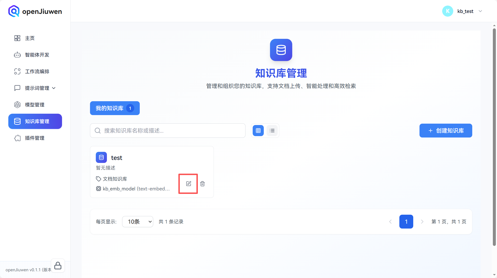
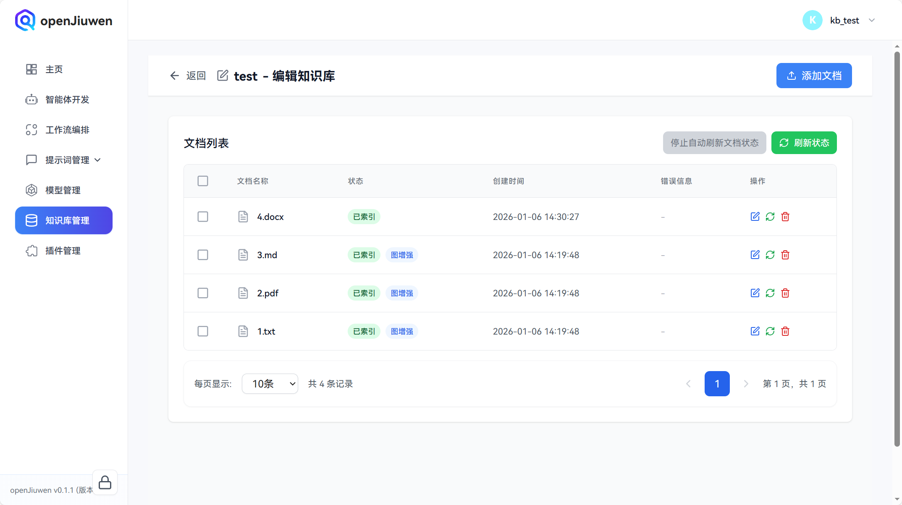

# 知识库管理

知识库是openJiuwen平台进行本地知识管理的重要方式，用户可以通过管理本地知识库增强智能体知识检索RAG能力。

# 创建知识库

## 前提条件

在**模型管理**模块的**Embedding模型**分页配置了可用的模型。如何配置Embedding模型请参考模型管理相关章节。

## 操作步骤

1. 登录openJiuwen平台。

2. 进入平台左侧导航栏的**知识库管理**模块。

3. 单击 **创建知识库** 按钮。

   

4. 在创建知识库弹窗中输入**知识库名称**与**描述**(可选)，在**Embedding模型**下拉选择一个模型（注意，知识库构建后该知识库的Embedding模型不可更改），点击**创建**。
   
   
   
5. 在创建完毕的知识库名片，点击**编辑**按钮。
   
   

6. 在编辑知识库页面，点击**添加文档**。

   

7. 在添加文档弹窗中，通过拖拽或者点击**选择文件**选择想要上传到知识库的文件（支持选择多个文件）后，点击**下一步**。

   

8. 在文档参数界面，配置文档解析和索引参数后，点击**下一步**。

   

   文档参数配置说明如下：

   | 参数名称     | 描述                  | 配置说明                                                                                                                                    |
   |----------|---------------------|-----------------------------------------------------------------------------------------------------------------------------------------|
   | 解析策略     | 控制文档的解析方式           | - **快速解析**：使用默认解析策略快速处理文档，适合大多数场景 - **注意**：当前仅支持快速解析模式                                                                               |
   | 分段策略     | 控制文档文本的分段方式         | - **自动分段与清洗**：系统自动进行文本分段和清洗，适合大多数场景 - **自定义**：手动配置分段参数，可精确控制分段效果 - **注意**：选择"自定义"后，需要配置子参数最大Token数与分段重叠百分比                        |
   | 最大Token数 | 单个分段的最大Token数量（子参数） | - **作用**：控制每个文本分段的长度 - **范围**：16-1024 - **默认值**：512 - **显示条件**：仅在分段策略选择"自定义"时显示 - **建议**：根据文档类型和检索需求设置，过小可能丢失上下文，过大可能影响检索精度 |
   | 分段重叠百分比  | 相邻分段之间的重叠比例（子参数）    | - **作用**：控制分段之间的重叠程度，保持上下文连贯性 - **范围**：0-50 - **默认值**：10 - **显示条件**：仅在分段策略选择"自定义"时显示 - **建议**：通常设置为 10-20，可根据文档特点调整         |
   | 文档图构建    | 是否构建文档图             | - **作用**：启用后可以构建文档图索引，提升复杂关系检索效果 - **注意**：启用文档图会增加索引构建时间以及消耗额外的大模型Token - **注意**：启用后，需要配置子参数LLM模型                                 |
   | LLM模型    | 用于文档图构建的大语言模型（子参数）  | - **作用**：文档图索引构建过程中用于提取实体和关系的模型 - **显示条件**：仅在启用文档图构建时显示此参数，且必须选择 - **建议**：选择性能稳定、支持长文本的模型                                         |                         |

9. 之后文档会逐个进行处理，可以点击**刷新状态**来获取文档最新状态，同时页面会自动刷新文档状态，可以通过**停止自动刷新文档状态**取消自动刷新。

   

10. 索引完毕的文档会显示**已索引**，启用了文档图构建索引的文档会带有**图增强**标签，未启用则不带。如果仍需要上传文档，可以通过右上角的**添加文档**继续操作。

   