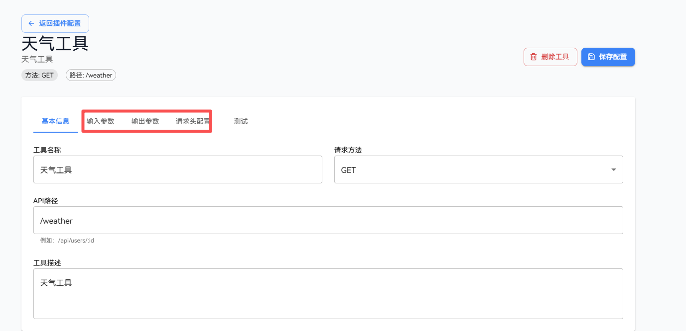
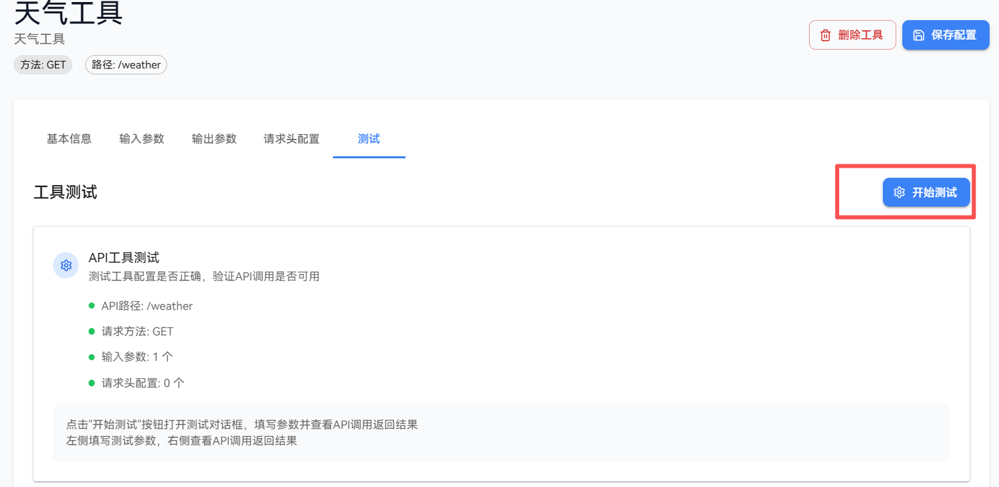

# 添加插件

插件是openJiuwen平台扩展功能的重要方式，用户可以通过添加插件来丰富工作流和智能体的能力。openJiuwen支持两种添加插件的方式：基于已有服务创建和手动创建本地代码插件。


## 方法1：基于已有服务创建插件
如果已知部署好的插件的服务请求URL和请求参数信息，用户可以直接基于该服务URL创建插件。

### 前提条件
1. 需要已部署好插件服务，且服务URL和请求参数信息已知，如用户需要自己部署插件服务可参考[后台运行插件服务](#后台运行插件服务)章节进行部署。

### 操作步骤
1. 登录openJiuwen平台。

2. 进入平台左侧导航栏的插件管理模块。

3. 单击”安装插件“按钮，选择”基于已有服务创建”。
   
   

4. 填写插件信息：
   
   
   
   创建云侧插件配置如下：
   
   | 配置项   | 说明                           |
   |:-----:|:---------------------------- |
   | 插件名称  | 插件的显示名称，用于识别插件               |
   | 插件描述  | 插件的功能描述，帮助用户了解插件的用途          |
   | 插件详情  | 插件的详细描述，支持markdown格式，帮助用户了解插件的详细配置方式          |
   | 服务URL | 插件对应的服务基础URL，插件将通过该URL调用服务接口 |

5. 单击”创建插件”按钮，完成插件创建。
   
   

6. 创建完成后，需要在已安装的插件列表中单击已安装插件的“设置”按钮，进入插件信息配置页面，配置插件中的工具，可参考[为插件添加工具](#为插件添加工具)章节进行工具配置。

   


### 示例
假设用户有一个已部署的天气插件服务，插件参数可以设置api-key（示例为：1234567890）等公共参数，其URL为https://example.com/plugin/weather。其获取指定地点天气的接口路径为：/weather/current，服务接口为GET方法，通过请求query中的loacation字段指定地点，可获取该地点的天气信息，用户可以基于该服务URL创建插件。

创建云侧插件的参数填写示例如下：


创建插件参数填写示例如下：

 

注释：
- 插件参数可以设置公共参数，如api-key等，这些参数在调用插件服务时会自动添加到请求参数中。
- 插件参数可以设置非运行时参数，此时会要求设置默认值，Agent或者工作流在调用插件时不用填写输入，且看不到该参数，默认值会被使用。
- 必填参数：插件参数可以设置为必填参数，此时在调用插件时必须填写该参数，否则会报错。
 
工具信息填写示例如下：


工具输入参数示例如下：


创建好插件和工具之后，可进行插件和工具测试，结果示例如下：


## 方法2：手动创建本地代码插件
openJiuwen 支持手动创建本地代码插件，用户可以直接编写代码（当前支持Python、JavaScript），编写好的代码作为插件提供用户使用。

### 操作步骤
1. 登录openJiuwen平台。

2. 进入平台左侧导航栏的插件管理模块。

3. 单击”安装插件”按钮，选择"本地代码插件-手动创建"。
   
   

4. **填写插件信息**，说明如下：
   
   | 配置项    | 说明                          |
   |:------:|:--------------------------- |
   | 插件名称   | 插件的显示名称，用于识别插件              |
   | 插件描述   | 插件的功能描述，帮助用户了解插件的用途         |

5. 单击”创建插件”按钮，创建插件进入插件编辑页面。
   
   

6. 在“配置选项”的“工具设置”中，单击“添加代码工具”按钮，添加代码工具。   

   

7. 在“创建工具”对话框中，填写工具信息，在代码编辑框中编辑代码，填写完单击“创建”按钮，填写信息说明参数如下：

   | 配置项    | 说明                          |
   |:------:|:--------------------------- |
   | 工具名称   | 工具的显示名称，用于识别工具              |
   | 工具描述   | 工具的功能描述，帮助用户了解工具的用途         |
   | IDE运行时 |  代码执行的语言环境，当前支持Python、JavaScript |

   

8. 创建工具后，自动跳转到插件工具配置页面，可以配置工具的基本信息，设置输入输出参数，设置执行代码，进行测试。

   

### 示例
假设用户希望自己设计一个自定义计算器插件，插件功能为实现自定义的运算符运算。
创建本地代码插件的示例如下：


创建工具配置的示例如下：


创建完成之后，用户可以测试工具效果。


# 后台运行插件服务
如果用户需要自定义插件，可参考当前openJiuwen studio后端的代码示例，后台运行插件服务，然后在安装插件的时候即可选择后台运行的插件。

## 操作步骤

1. 参考plugin_server/routers/demo_router.py代码，编写插件工具的接口信息和业务处理逻辑。
   
      ```python
   from fastapi import HTTPException, Query

   from . import BasePluginRouter

   demo_router = BasePluginRouter(
       name="demo",
       description="your_demo_tool_description",
   )

   @demo_router.router.get("/run")
   async def run_demo(
       query: str = Query(..., description="query parameter description")
   ):
       try:
           return {
               "result": "success",
               "query": query,
           }
       except Exception as e:
           raise HTTPException(
               status_code=500,
               detail=f"run failed: {str(e)}"
           ) from e

   # 注册端点信息
   demo_router.register_endpoint("GET", "/run", run_demo, "run demo")
   ```

   当前plugin_server/routers/demo_router.py代码定义了一个/demo/run GET接口，该接口接受一个query参数，
   返回success及query参数值。

2. 参考plugin_server/run_restful.py代码，启动自定义插件服务服务。
   ```python
   import uvicorn
   from dotenv import load_dotenv

   from restful_tool_router import app

   # Load environment variables from .env file
   load_dotenv()

   # 定义 main 函数（供脚本入口调用）
   def main():
      # 尝试多种启动方式
      try:
         # 方法1: 标准方式
         uvicorn.run(app, host="0.0.0.0", port=8185)
      except TypeError as e:
         if "loop_factory" in str(e):
               # 方法2: 兼容方式
               import asyncio
               config = uvicorn.Config(app, host="0.0.0.0", port=8185)
               server = uvicorn.Server(config)
               asyncio.run(server.serve())
         else:
               raise

   if __name__ == "__main__":
      main()
   ```

   需要指定host和port，默认值分别为0.0.0.0和8135。
   
3. 如需要调用该接口，在创建云侧插件弹窗中配置插件url为http://localhost:8185

   

   参考[为插件添加工具](#为插件添加工具)章节，配置好接口信息，为插件添加一个/demo/run工具，测试结果示例如下：

   


# 为插件添加工具

插件工具是插件的具体功能实现，每个插件可以包含一个或多个工具。工具定义了插件与外部系统交互的方式，包括API接口、输入参数、输出格式等。通过为插件配置工具，可以实现插件的具体功能调用。

## 操作步骤

1. 登录openJiuwen平台。

2. 进入平台左侧导航栏的插件管理模块。

3. 在”已安装“插件列表中找到目标插件，单击插件配置按钮。

   

4. 进入插件配置页面后，单击”工具设置”选项卡，然后单击”添加工具”按钮。
   
   

5. 配置工具基本信息（以URL插件为例）：
   
   
   
   **填写创建工具信息：**
   
   | 配置项   | 说明                                                                                                                           |
   |:-----:|:---------------------------------------------------------------------------------------------------------------------------- |
   | 工具名称  | 输入工具的显示名称                                                                                                                    |
   | 工具描述  | 描述工具的功能                                                                                                                      |
   | API路径 | 输入具体的API端点路径<br>例如：如果服务URL是 `http://localhost:8000`<br>天气查询API路径为 `/weather`<br>完整URL将是 `http://localhost:8000/weather` |

6. 配置工具参数：
   
   
   
   (1) **输入参数配置**
   
   | 配置项  | 说明                       |
   |:----:|:------------------------ |
   | 参数名称 | 参数的标识符                   |
   | 参数类型 | string, number, boolean等 |
   | 必需参数 | 是否为必填项                   |
   | 参数描述 | 参数的作用说明                  |
   
      例如天气工具的入参：
   
   | 配置项               | 说明   |
   |:-----------------:|:---- |
   | city: string (必需) | 城市名称 |
   | date: string (可选) | 查询日期 |
   
   (2) **输出参数配置**
   
   | 配置项  | 说明                      |
   |:----:|:----------------------- |
   | 字段名称 | 返回数据的字段名                |
   | 字段类型 | string, number, object等 |
   | 字段描述 | 字段含义说明                  |
   
   (3) **请求头配置**
   
   | 配置项    | 说明                             |
   |:------:|:------------------------------ |
   | 自定义请求头 | 可以设置自定义HTTP请求头                 |
   | 支持的标准头 | Content-Type、Authorization等标准头 |

7. 配置完成后，单击”开始测试”按钮测试工具功能。
   
   

8. 根据配置的参数输入测试数据，单击执行查看结果。
   
   

9. 系统会显示API调用的结果，验证返回数据格式是否正确。

10. 测试通过后，单击"保存"按钮，完成工具的添加。
