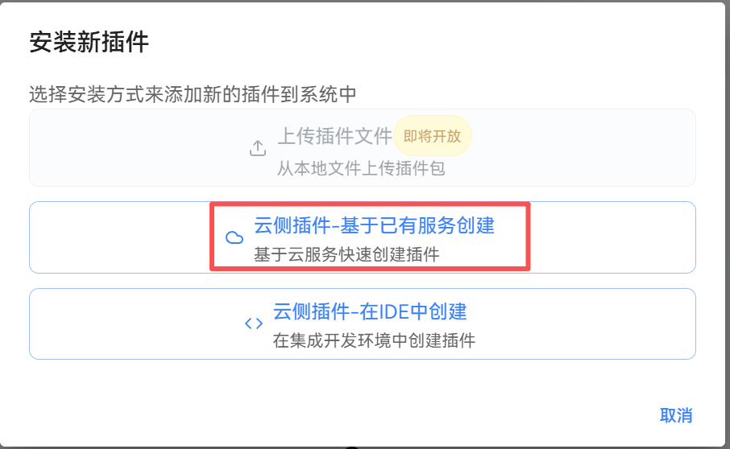
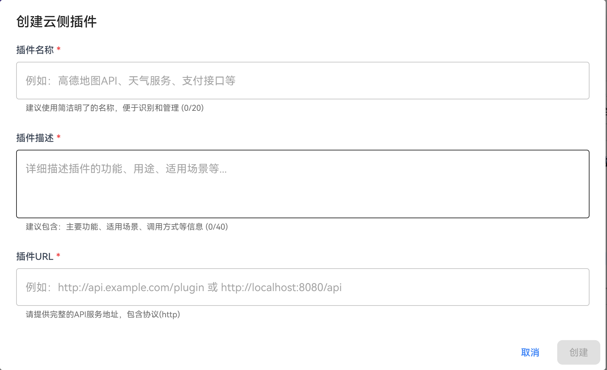
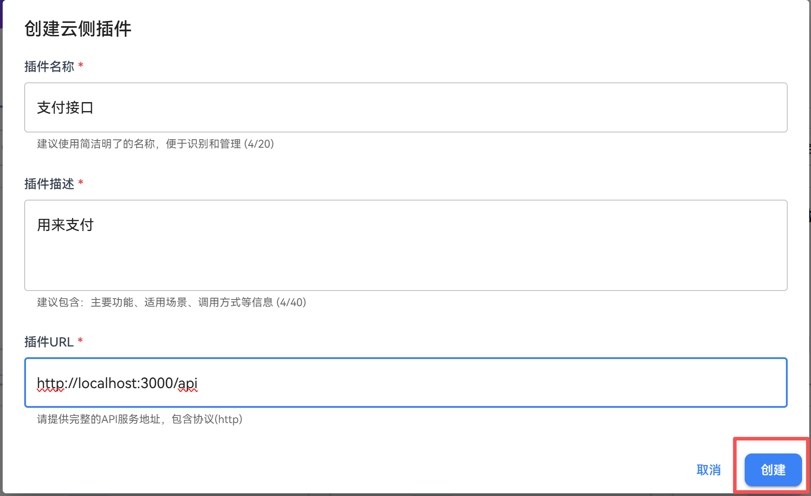
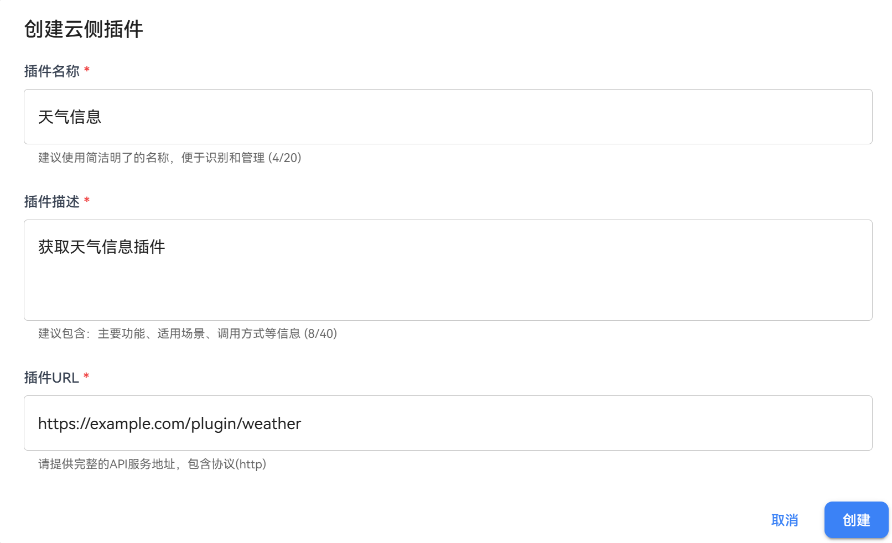
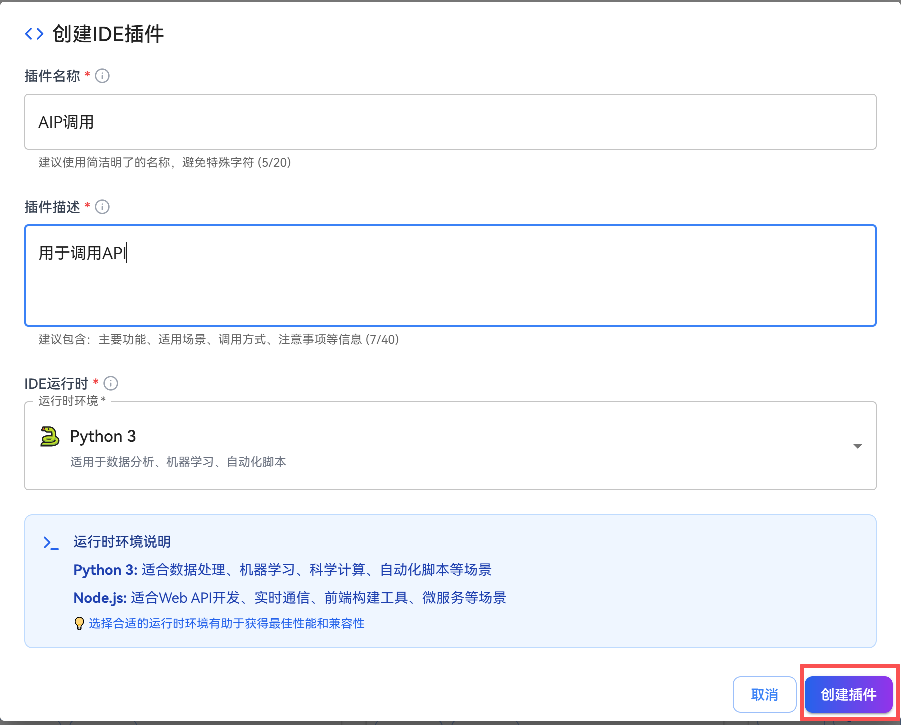
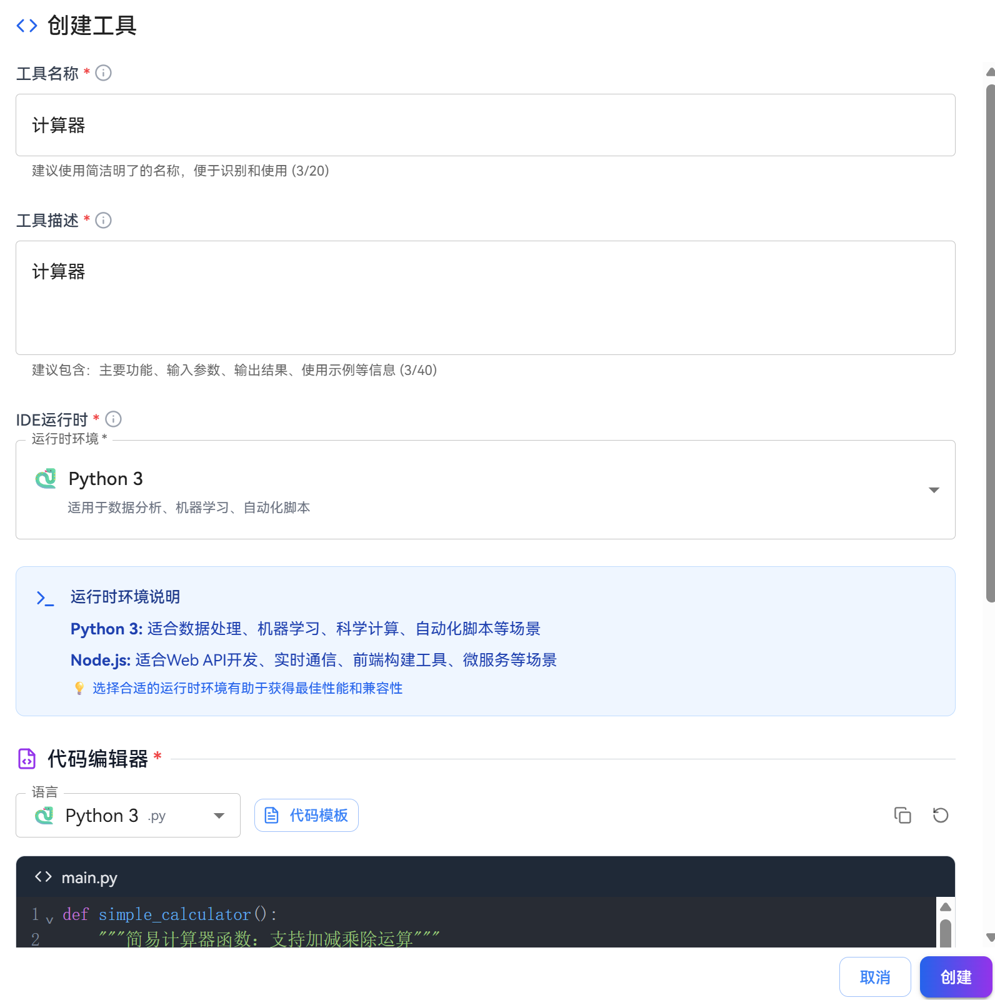
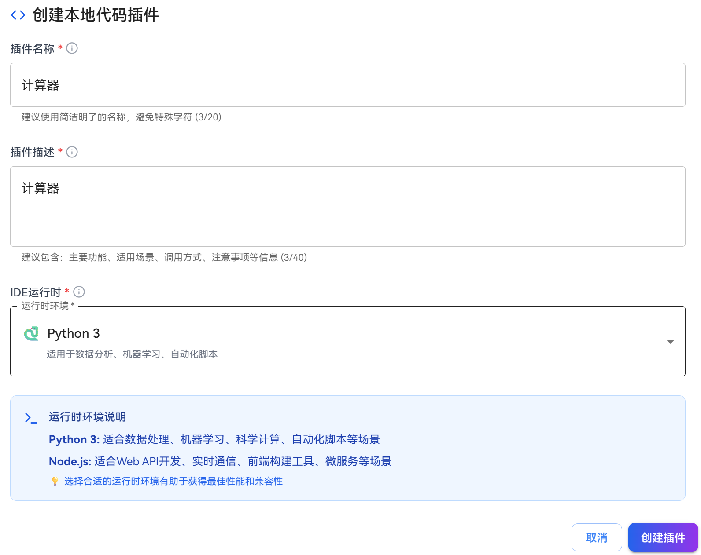
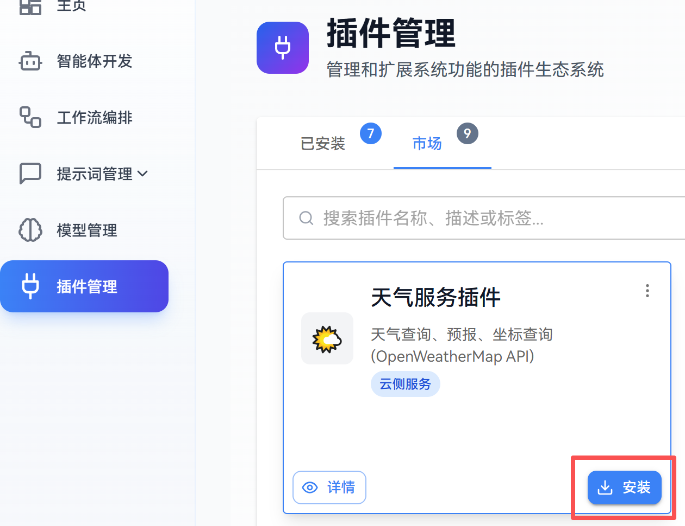

# 添加插件

插件是openJiuwen平台扩展功能的重要方式，用户可以通过添加插件来丰富工作流和智能体的能力。openJiuwen支持三种添加插件的方式：基于已有服务创建、手动创建本地代码插件和在市场安装插件。

## 方法1：基于已有服务创建插件
如果已知部署好的插件的服务请求URL和请求参数信息，用户可以直接基于该服务URL创建插件。

### 操作步骤
1. 登录openJiuwen平台。

2. 进入平台左侧导航栏的插件管理模块。

3. 单击”安装插件“按钮，选择”基于已有服务创建”。
   
   

4. 填写插件信息：
   
   
   
   创建云侧插件配置如下：
   
   | 配置项   | 说明                           |
   |:-----:|:---------------------------- |
   | 插件名称  | 插件的显示名称，用于识别插件               |
   | 插件描述  | 插件的功能描述，帮助用户了解插件的用途          |
   | 服务URL | 插件对应的服务基础URL，插件将通过该URL调用服务接口 |

5. 单击”创建”按钮，完成插件创建。
   
   

6. 创建完成后，需要在已安装的插件列表中单击已安装插件的“设置”按钮，进入插件信息配置页面，配置插件中的工具，可参考[为插件添加工具](#为插件添加工具)章节进行工具配置。

   

### 示例
假设用户有一个已部署的天气插件服务，其URL为`https://example.com/plugin/weather`，其获取指定地点天气的接口路径为：/weather/current，服务接口为GET方法，通过请求query中的loacation字段指定地点，可获取该地点的天气信息，用户可以基于该服务URL创建插件。

创建云侧插件的参数填写示例如下：

   
工具信息填写示例如下：

工具输入参数示例如下：

创建好插件和工具之后，可进行插件和工具测试，结果示例如下：

## 方法2：手动创建本地代码插件
openJiuwen 支持手动创建本地代码插件，用户可以直接编写代码（当前支持Python、JavaScript），编写好的代码作为插件提供用户使用。

### 操作步骤
1. 登录openJiuwen平台。

2. 进入平台左侧导航栏的插件管理模块。

3. 单击”安装插件”按钮，选择"本地代码插件-手动创建"。
   
   

4. **填写插件信息**，说明如下：
   
   | 配置项    | 说明                          |
   |:------:|:--------------------------- |
   | 插件名称   | 插件的显示名称，用于识别插件              |
   | 插件描述   | 插件的功能描述，帮助用户了解插件的用途         |
   | IDE运行时 | 插件运行的环境，根据插件代码语言和依赖选择合适的运行时 |

5. 单击”创建插件”按钮，创建插件进入插件编辑页面。
   
   

6. 在“配置选项”的“工具设置”中，单击“添加代码工具”按钮，添加代码工具。   

   

7. 在“创建工具”对话框中，填写工具信息，在代码编辑框中编辑代码，填写完单击“创建”按钮，填写信息说明参数如下：

   | 配置项    | 说明                          |
   |:------:|:--------------------------- |
   | 工具名称   | 工具的显示名称，用于识别工具              |
   | 工具描述   | 工具的功能描述，帮助用户了解工具的用途         |
   | 语言 |  代码执行的语言，当前支持Python、JavaScript |

   

8. 创建工具后，自动跳转到插件工具配置页面，可以配置工具的基本信息，设置输入输出参数，设置执行代码，进行测试。

   

### 示例
假设用户希望自己设计一个自定义计算器插件，插件功能为实现自定义的运算符运算。
创建本地代码插件的示例如下：

创建工具配置的示例如下：

创建完成之后，用户可以测试工具效果。

## 方法3：在市场安装
当前openJiuwen平台在插件市场中已有部分预置插件，用户可以在市场中查找并安装符合需求的插件。openJiuwen平台提供了以下9个预置插件，用户可以直接在市场中安装使用，说明如下：

| 插件名称 | 功能描述 |
|:------:|:--------|
| 天气服务插件 | 提供天气查询功能，可获取指定地区的实时天气信息、天气预报等 |
| 系统管理插件 | 提供系统级别的管理功能，包括系统监控、健康检查、API文档查询等 |
| 图像生成插件 | 基于AI技术生成图像，支持多种图像类型和场景 |
| 翻译服务插件 | 提供多语言翻译功能，支持主流语言之间的互译 |
| 文本处理插件 | 提供文本续写、摘要等处理功能 |
| 链接读取插件 | 获取网页内容，提取网页中的文本信息 |
| 智能问答插件 | 基于大语言模型的智能问答功能 |
| 自然语言处理插件 | 提供文本的情感分析、实体识别、语义理解等NLP功能 |
| 高德地图插件 | 基于高德地图API的位置服务和路径规划功能 |

### 操作步骤
1. 登录openJiuwen平台。

2. 进入平台左侧导航栏的插件管理模块。

3. 单击”市场“，进入市场插件列表页面。
   
   

4. 在市场插件列表中找到目标插件，单击"安装"按钮，完成插件安装。

   

# 为插件添加工具

插件工具是插件的具体功能实现，每个插件可以包含一个或多个工具。工具定义了插件与外部系统交互的方式，包括API接口、输入参数、输出格式等。通过为插件配置工具，可以实现插件的具体功能调用。

## 操作步骤

1. 登录openJiuwen平台。

2. 进入平台左侧导航栏的插件管理模块。

3. 在”已安装“插件列表中找到目标插件，单击插件配置按钮。

   

4. 进入插件配置页面后，单击”工具设置”选项卡，然后单击”添加工具”按钮。
   
   

5. 配置工具基本信息（以URL插件为例）：
   
   
   
   **填写创建工具信息：**
   
   | 配置项   | 说明                                                                                                                           |
   |:-----:|:---------------------------------------------------------------------------------------------------------------------------- |
   | 工具名称  | 输入工具的显示名称                                                                                                                    |
   | 工具描述  | 描述工具的功能                                                                                                                      |
   | API路径 | 输入具体的API端点路径 例如：如果服务URL是 `http://localhost:8000` 天气查询API路径为 `/weather` 完整URL将是 `http://localhost:8000/weather` |

6. 配置工具参数：
   
   
   
   (1) **输入参数配置**
   
   | 配置项  | 说明                       |
   |:----:|:------------------------ |
   | 参数名称 | 参数的标识符                   |
   | 参数类型 | string, number, boolean等 |
   | 必需参数 | 是否为必填项                   |
   | 参数描述 | 参数的作用说明                  |
   
      例如天气工具的入参：
   
   | 配置项               | 说明   |
   |:-----------------:|:---- |
   | city: string (必需) | 城市名称 |
   | date: string (可选) | 查询日期 |
   
   (2) **输出参数配置**
   
   | 配置项  | 说明                      |
   |:----:|:----------------------- |
   | 字段名称 | 返回数据的字段名                |
   | 字段类型 | string, number, object等 |
   | 字段描述 | 字段含义说明                  |
   
   (3) **请求头配置**
   
   | 配置项    | 说明                             |
   |:------:|:------------------------------ |
   | 自定义请求头 | 可以设置自定义HTTP请求头                 |
   | 支持的标准头 | Content-Type、Authorization等标准头 |

7. 配置完成后，单击”开始测试”按钮测试工具功能。
   
   

8. 根据配置的参数输入测试数据，单击执行查看结果。
   
   

9. 系统会显示API调用的结果，验证返回数据格式是否正确。

10. 测试通过后，单击"保存"按钮，完成工具的添加。
