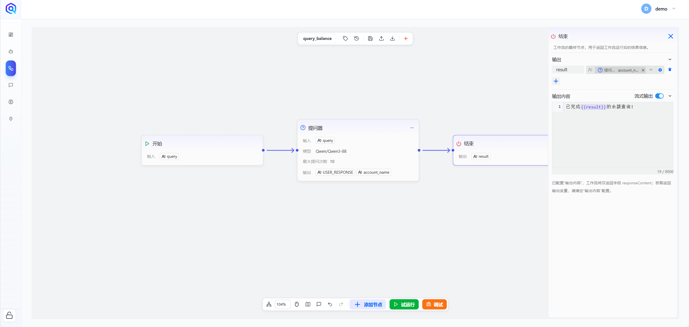
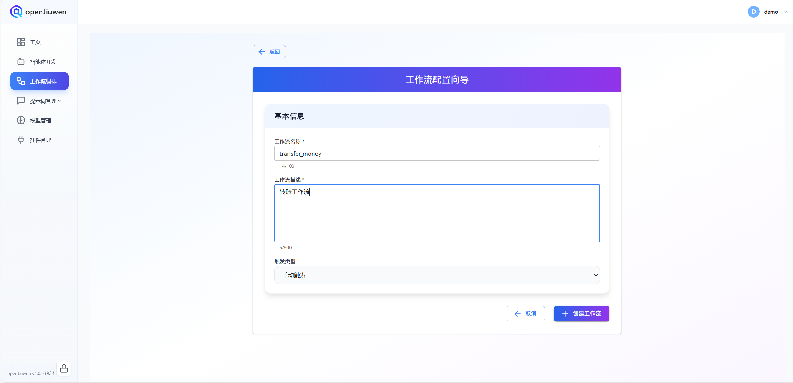
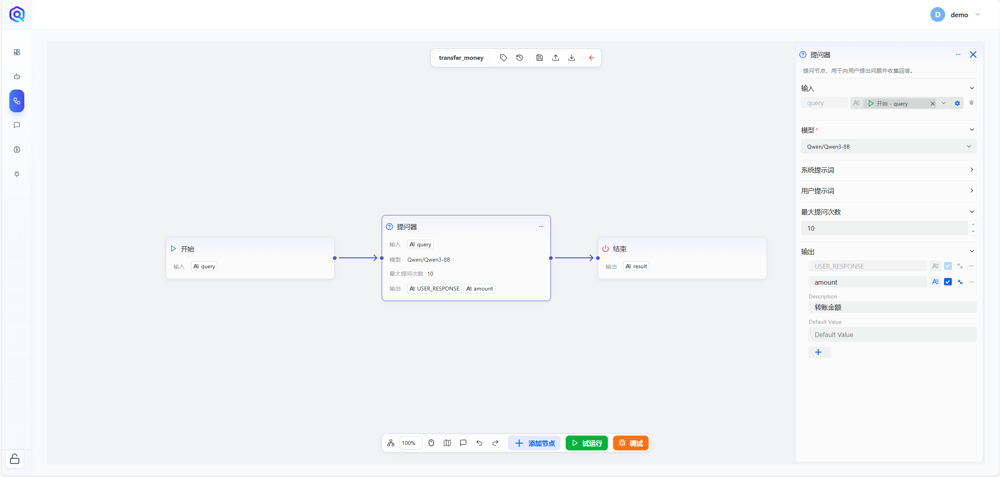
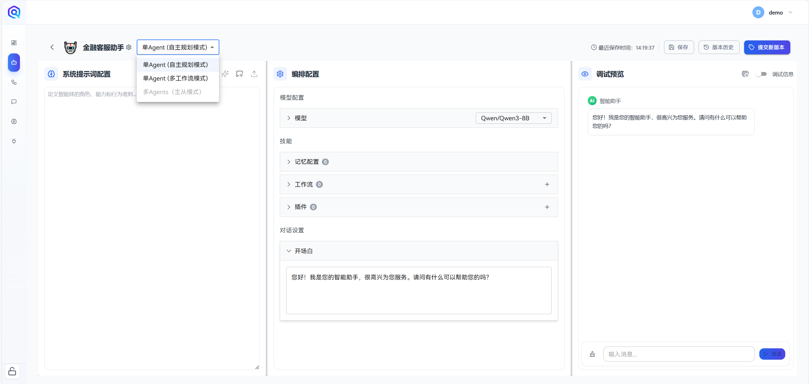
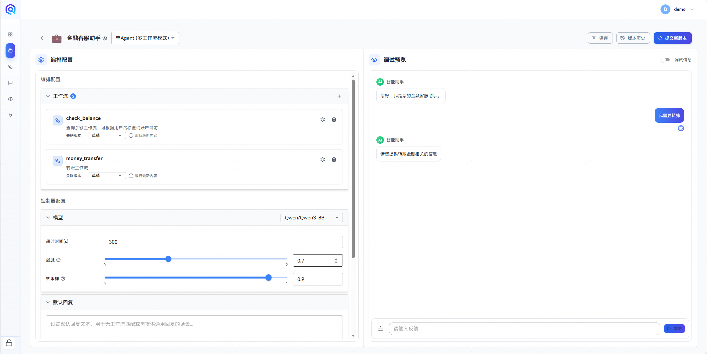
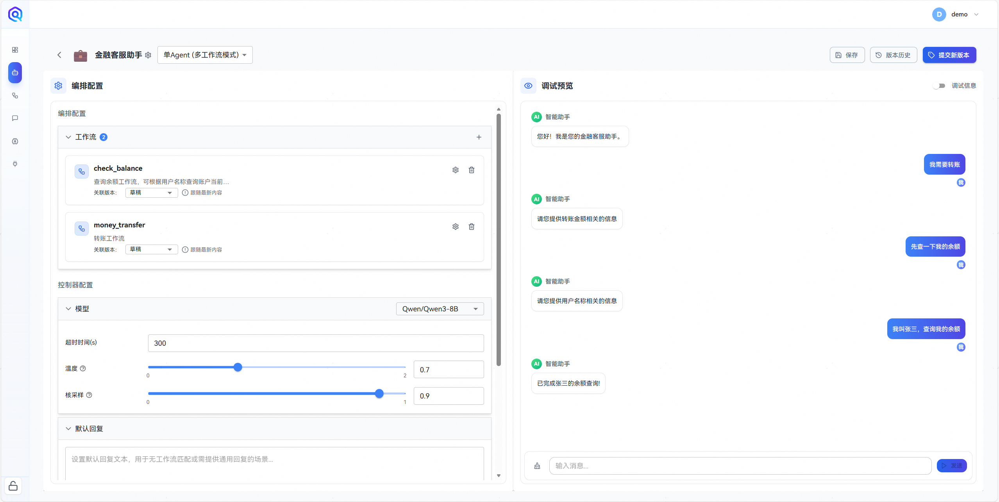

本文介绍了基于openJiuwen低代码开发多工作流模式智能体的实现方法。

## 一、搭建工作流

在开始构建智能体之前，需要准备相应的工作流。本文以两个示例工作流进行演示：**余额查询工作流**与​**转账工作流**​。

### 1. 余额查询工作流搭建

该工作流用于模拟余额查询场景。

- ​**步骤一**​：在首页点击“创建工作流”，进入工作流开发界面。
  
- ​**步骤二**​：填写工作流名称 `query_balance` 及描述信息 `余额查询工作流，可以根据用户名称查询名下账户余额`，并点击“确认创建”。
  
- ​**步骤三**​：在画布中添加提问器节点，并按照图示设置提问器相关配置。
  
  
- ​**步骤四**​：在结束节点中，将提问器的输出拼接在预设的输出中，并启用流式输出。
  
  至此，余额查询工作流已完成搭建。

### 2. 转账工作流搭建

该工作流用于模拟账户转账场景。

- **步骤一**：仿照余额查询工作流，创建一个新的工作流并进入画布。
  
- **步骤二**：添加提问器节点，并在节点配置中设置待提问的参数。
  
- **步骤三**：将各节点连接完整，并在结束节点中设置流式输出。
  
  至此，转账工作流已完成搭建。

## 二、搭建多工作流模式智能体

在完成上述两个工作流的准备后，即可开始构建多工作流模式的智能体。
​**步骤一**​：进入智能体开发界面，点击“创建智能体”。

​**步骤二**​：填写智能体名称 `金融客服助手` 及功能描述 `一个金融客服助手，可以完整转账和余额查询服务`。

​**步骤三**​：智能体默认模式为 `自主规划模式`，需手动切换为 `多工作流模式`。

​**步骤四**​：在编排配置中，添加已创建的两个工作流，并在对话设置中配置开场白。
完成以上步骤后，一个基于多工作流模式的金融客服助手即搭建完成。

## 三、效果测试
现在测试一下效果，在右侧对话框中输入我们的第一个问题：`我需要转账`。智能体可以正确地使用转账工作流中的提问器向用户提问。

这个时候输入`先查一下我的余额`。可以看到智能体从当前工作流中跳出，并进入余额查询的工作流中，向用户询问待查询的用户名。

然后告知智能体`我叫张三，查询我的余额`。智能体可以顺利恢复当前工作流，完成账户余额查询。

最后，我们输入`给李四转账100元`，智能体恢复上一工作流的状态，并完成转账操作。

