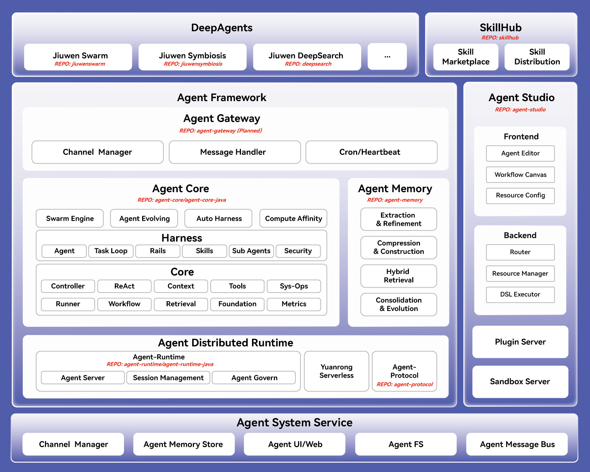

# 什么是openJiuwen

随着人工智能的不断发展，大语言模型技术日益成熟。AI应用已经从最初专注于语音识别等简单任务的应用，演进到能够进行自主推理决策，完成复杂任务的Agent。基于大语言模型的AI Agent，具备自主性、目标导向性和交互性，能够在复杂多变的环境中感知信息、推理决策并执行任务。在各个行业场景中，AI Agent都展示出巨大的应用潜力，广泛应用于客户支持、销售拓展、医疗诊断和金融分析等场景。

openJiuwen作为开源Agent平台，致力于提供灵活、强大且易用的AI Agent开发与运行能力。基于该平台，开发者可快速构建处理各类简单或复杂任务的AI Agent，实现多Agent协同交互，高效开发生产级可靠AI Agent；并助力企业与个人快速搭建AI Agent系统或平台，推动商用级Agentic AI技术广泛应用与落地。

# 应用场景

面向消费者和企业场景，openJiuwen提供了快速搭建AI Agent应用的能力，助力个人和企业提升开发效率、执行准确率和系统性能。

**面向消费者的应用场景**

用户可通过零代码、低代码或基于SDK的方式，结合Prompt自优化技术，快速构建复杂单/多轮对话Agent，大幅提升开发效率，满足个性化需求。

- 聊天助手：通过自然语言处理和上下文理解能力，实现高度拟人化的对话交互，广泛应用于客服、用户支持等场景，提升用户体验与满意度。
- 文本生成：基于大模型强大的语言生成能力，支持撰写文章、创意文案、新闻稿等内容，满足营销、创作等领域的多样化需求。
- 智能助手：结合任务规划与多Agent协同能力，实现日程管理、信息查询、事务处理等智能化服务，提升个人与团队的工作效率。

**面向企业的应用场景**

企业可利用openJiuwen的工作流引擎和多Agent协同能力，快速搭建、部署并高效执行各类Workflow Agent，实现复杂任务的自主规划、分解与执行，显著降低技术落地成本，助力企业加速智能体商业化落地。

- 金融行业：通过多Agent协同能力，实现多级意图跳转、智能化的任务分配和动态的Agent调度，助力金融机构构建出具有高精度、低时延、高可靠性和强安全性的一体化服务能力。
- 医疗健康：支持自定义开发医疗智能体，高效生成病历摘要、进行影像资料的初步筛查，并提供诊疗建议。深度整合专业医学知识和上下文信息，为医生提供精准、全面的辅助决策支持，有效提升诊断效率与准确率。

# 产品优势

openJiuwen平台的关键优势包括：

- 全场景适配：面向ToB与ToC的全场景设计，满足企业和个人在不同应用场景下的需求。
- 灵活的开发方式：提供零代码、低代码和使用SDK等多种开发方式，帮助用户根据需求和技术背景自由选择开发方式。
- 高效精准的任务执行：确保AI Agent在执行任务时的高效性与精准性，优化任务处理流程，提升工作效率。
- 多Agent协同能力：支持Multi-Agent的协同工作，能够处理复杂的业务流程和跨领域任务，提升整体效率。
- 稳定的生产环境支持：提供商用级稳定性与高可用性，确保在大规模生产环境中的可靠运行，助力企业和个人快速实现商用级Agentic AI技术的落地应用。

# 系统架构

openJiuwen 采用分层架构设计，覆盖 AI Agent 从开发、运行到部署和运维的完整生命周期，整体由 **DeepAgents**、**Agent Studio** 、**Agent Framework**、**Agent Distributed Runtime**、**Agent System Service** 组成。
- **DeepAgents**：提供面向不同场景的复杂智能体，如 JiuwenSwarm、JiuwenSymbiosis、DeepSearch 等，支持开箱即用。 
- **Agent Studio**：一站式 AI Agent 开发平台，提供低代码 / 零代码可视化开发能力，支持 Agent 开发、工作流编排、Prompt 调优、在线调试和资源管理，帮助开发者快速打造和调试智能体及工作流。
- **Agent Framework**: openJiuwen 核心框架与执行引擎，为开发者提供多场景、易用的 Agent 开发、编排与调用接口。覆盖复杂任务规划、循环执行、工具与技能调用、上下文管理、记忆子系统、多智能体协同、Agent 自演进、算力亲和调度等关键特性，全面支撑单体 Agent 到多 Agent 协同的工程化落地。
- **Agent Distributed Runtime**: 提供分布式 Agent 运行时底座，支持低码、高码两种智能体部署模式，实现 Agent 一键发布部署与全生命周期统一管控。原生内置多租户资源隔离、服务弹性扩缩容、统一注册发现、跨集群高速互通等核心能力，全面支撑大规模多 Agent 集群稳定运行、业务规模化落地。
- **Agent System Service**：AgentOS 底层基础系统服务，内置系统级安全隔离沙箱、全局统一记忆持久化存储、原生 CLI 系统工具、标准化 Agent 文件系统、跨Agent通信总线等底层核心能力，支撑全平台智能体安全运行、资源统一调度与多Agent高效协同。

## 实现概览

openJiuwen 采用模块化仓库设计，逐层构建 AI Agent 开发生态。各仓库可独立演进，也可组合使用，覆盖从智能体应用、技能分发、可视化编排、框架开发到服务化运行的完整链路。

### 代码仓总览

<table style="width: 100%; border-collapse: collapse; table-layout: fixed;">
  <colgroup>
    <col style="width: 18%;" />
    <col style="width: 26%;" />
    <col style="width: 56%;" />
  </colgroup>
  <thead>
    <tr>
      <th style="border: 1px solid; padding: 10px 12px; text-align: left; font-weight: 700;">模块</th>
      <th style="border: 1px solid; padding: 10px 12px; text-align: left; font-weight: 700;">仓库</th>
      <th style="border: 1px solid; padding: 10px 12px; text-align: left; font-weight: 700;">说明</th>
    </tr>
  </thead>
  <tbody>
    <tr>
      <td rowspan="3" style="border: 1px solid; padding: 10px 12px; font-weight: 700; vertical-align: middle;">Deep Agents</td>
      <td style="border: 1px solid; padding: 10px 12px; vertical-align: top;"><a href="https://gitcode.com/openJiuwen/jiuwenswarm">jiuwenswarm</a></td>
      <td style="border: 1px solid; padding: 10px 12px; vertical-align: top;">多智能体协同框架与官方旗舰应用，支持复杂任务协作与 Skill 自演进。</td>
    </tr>
    <tr>
      <td style="border: 1px solid; padding: 10px 12px; vertical-align: top;"><a href="https://gitcode.com/openJiuwen/jiuwensymbiosis">jiuwensymbiosis</a></td>
      <td style="border: 1px solid; padding: 10px 12px; vertical-align: top;">面向具身智能的 Agent 框架，支持构型无关的能力复用与安全控制。</td>
    </tr>
    <tr>
      <td style="border: 1px solid; padding: 10px 12px; vertical-align: top;"><a href="https://gitcode.com/openJiuwen/deepsearch">deepsearch</a></td>
      <td style="border: 1px solid; padding: 10px 12px; vertical-align: top;">知识增强型深度检索与研究 Agent，面向搜索、推理和报告生成场景。</td>
    </tr>
    <tr>
      <td style="border: 1px solid; padding: 10px 12px; font-weight: 700; vertical-align: middle;">SkillHub</td>
      <td style="border: 1px solid; padding: 10px 12px; vertical-align: top;"><a href="https://gitcode.com/openJiuwen/skillhub">skillhub</a></td>
      <td style="border: 1px solid; padding: 10px 12px; vertical-align: top;">Skill 托管与分发平台，支持 Skill 发布、版本管理、检索下载、共享复用及私有化部署。</td>
    </tr>
    <tr>
      <td style="border: 1px solid; padding: 10px 12px; font-weight: 700; vertical-align: middle;">Agent Studio</td>
      <td style="border: 1px solid; padding: 10px 12px; vertical-align: top;"><a href="https://gitcode.com/openJiuwen/agent-studio">agent-studio</a></td>
      <td style="border: 1px solid; padding: 10px 12px; vertical-align: top;">一站式可视化 Agent 开发平台，支持 Agent 编辑、工作流编排、资源配置、Prompt 调优与在线调试。</td>
    </tr>
    <tr>
      <td rowspan="4" style="border: 1px solid; padding: 10px 12px; font-weight: 700; vertical-align: middle;">Agent Framework</td>
      <td style="border: 1px solid; padding: 10px 12px; vertical-align: top;">agent-gateway</td>
      <td style="border: 1px solid; padding: 10px 12px; vertical-align: top;">统一接入网关，提供 Channel 管理、消息处理、定时任务与心跳等能力，当前 Opening Soon。</td>
    </tr>
    <tr>
      <td style="border: 1px solid; padding: 10px 12px; vertical-align: top;"><a href="https://gitcode.com/openJiuwen/agent-core">agent-core</a></td>
      <td style="border: 1px solid; padding: 10px 12px; vertical-align: top;">Python Agent SDK，提供 Agent 编排、运行时、模型、工具、检索与评测等核心能力。</td>
    </tr>
    <tr>
      <td style="border: 1px solid; padding: 10px 12px; vertical-align: top;"><a href="https://gitcode.com/openJiuwen/agent-core-java">agent-core-java</a></td>
      <td style="border: 1px solid; padding: 10px 12px; vertical-align: top;">Java Agent SDK，为 Java 生态提供与 Python SDK 一致的 Agent 开发能力。</td>
    </tr>
    <tr>
      <td style="border: 1px solid; padding: 10px 12px; vertical-align: top;"><a href="https://gitcode.com/openJiuwen/agent-memory">agent-memory</a></td>
      <td style="border: 1px solid; padding: 10px 12px; vertical-align: top;">智能体长期记忆系统，支持记忆抽取、压缩、混合检索、沉淀构建与自主演化。</td>
    </tr>
    <tr>
      <td rowspan="3" style="border: 1px solid; padding: 10px 12px; font-weight: 700; vertical-align: middle;">Agent Distributed Runtime</td>
      <td style="border: 1px solid; padding: 10px 12px; vertical-align: top;"><a href="https://gitcode.com/openJiuwen/agent-runtime">agent-runtime</a></td>
      <td style="border: 1px solid; padding: 10px 12px; vertical-align: top;">Python Agent Runtime，负责 Agent 服务化运行、会话管理与生命周期管理。</td>
    </tr>
    <tr>
      <td style="border: 1px solid; padding: 10px 12px; vertical-align: top;"><a href="https://gitcode.com/openJiuwen/agent-runtime-java">agent-runtime-java</a></td>
      <td style="border: 1px solid; padding: 10px 12px; vertical-align: top;">Java Agent Runtime，基于 Spring Boot 提供 Agent 服务化运行与部署能力。</td>
    </tr>
    <tr>
      <td style="border: 1px solid; padding: 10px 12px; vertical-align: top;"><a href="https://gitcode.com/openJiuwen/agent-protocol">agent-protocol</a></td>
      <td style="border: 1px solid; padding: 10px 12px; vertical-align: top;">Agent 互操作协议 SDK，提供 MCP SDK、A2A SDK 与 A2X Registry。</td>
    </tr>
  </tbody>
</table>

# 功能特性

openJiuwen在开发态提供了Agent编排构建的能力，帮助开发者快速构建Agent，进行高效开发。openJiuwen在运行态提供了高可靠执行引擎作为底座的能力，为智能体的高效运行提供保证。

**Agent编排**

openJiuwen致力于提供高效、灵活的Agent应用开发支持，帮助用户快速构建智能化、自动化的Agent应用系统，轻松应对各类复杂任务。目前，openJiuwen目前提供了ReActAgent和WorkflowAgent这两种预置智能体，提供了丰富的功能和灵活的开发选项，满足用户不同场景下的智能需求。

- ReActAgent：ReActAgent是一种遵循ReAct（Reasoning + Action）规划模式的Agent，通过 “思考（Thought）→ 行动（Action）→ 观察（Observe）”的循环迭代完成用户任务。其强大的多轮推理与自我修正能力，使ReActAgent具备动态决策能力且能够灵活应对环境变化，适用于需要复杂推理和策略调整的多样化任务场景。
  
- Workflow Agent：Workflow Agent是一种专注于多步骤、任务导向的流程自动化Agent，通过严格遵循用户预定义的任务流程高效地执行复杂任务。其侧重于基于预设流程实现任务的规范化与高效化执行，适用于任务结构清晰、可分解为多个步骤的场景。
  

**高可靠执行引擎**

提供高可靠执行引擎能力，支持分布式部署和低成本运行，解决海量Agent执行效率低、成本高的问题，有效支撑海量Agent运行和行业生产应用落地。

- 批流混合的图执行架构：支持批数据与流数据在统一图结构中的协同执行，通过组件化与数据流传递机制，实现复杂 Workflow 的高效编排，实时输出。
- 状态自动管理与中断恢复：通过会话级状态建模、状态持久化与断点续传机制，保障高频交互和异常终端场景下任务可连续执行，并支持多实例部署下的一致性与隔离性。
- 全链路可观测与调测能力：覆盖端到端执行过程的实时监控、调用追踪与异常关联分析，为复杂 Agent 系统在高并发环境下的稳定运行与快速问题定位提供工程级保障。

# 大语言模型支持

openJiuwen支持主流供应商提供的多种开源和商业大模型，例如Pangu、Qwen、DeepSeek等。我们会持续更新openJiuwen支持的大语言模型。如果您有任何建议或需求，欢迎随时向我们反馈，我们将积极采纳并优化，努力为大家提供更好的支持和服务。

